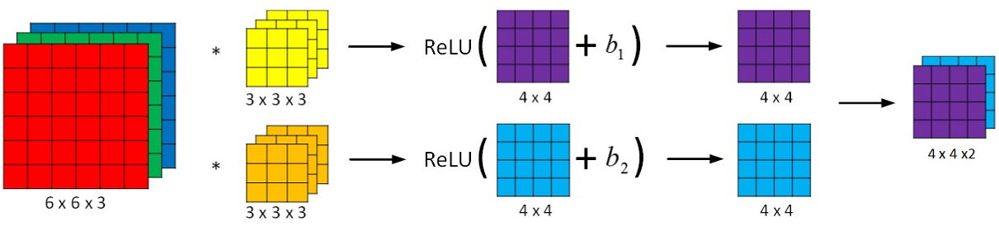
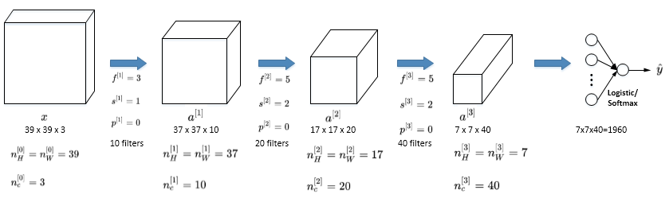

# Foundations-of-Convolutional-Neural-Networks

## 1. 计算机视觉(Computer vision)

图片分类，或图片识别、目标检测、神经网络实现图片风格迁移：

使用传统神经网络处理机器视觉的一个主要问题是输入层维度很大。例如一张64x64x3的图片，神经网络输入层的维度为12288。如果图片尺寸较大，例如一张1000x1000x3的图片，神经网络输入层的维度将达到3百万，使得网络权重W非常庞大。这样会造成两个后果，一是神经网络结构复杂，数据量相对不够，容易出现过拟合；二是所需内存、计算量较大。解决这一问题的方法就是使用卷积神经网络(CNN)。

## 2. 边缘检测示例(Edge detection example)

对于CV问题，神经网络由浅层到深层，分别可以检测出图片的边缘特征 、局部特征（例如眼睛、鼻子等）、整体面部轮廓

#### 图片的边缘检测

最常检测的图片边缘有两类：一是**垂直边缘(vertical edge)**，二是**水平边缘(horizontal edges)**

图片的边缘检测可以通过与相应滤波器进行卷积来实现。以垂直边缘检测为例，原始图片尺寸为6x6，滤波器filter尺寸为3x3，卷积后的图片尺寸为4x4，得到结果为右图

> 表示卷积操作。python中，卷积用conv\_forward()表示；tensorflow中，卷积用tf.nn.conv2d()表示；keras中，卷积用Conv2D()表示

垂直边缘是一个3×3的区域，左边是明亮的像素，中间的并不需要考虑，右边是深色像素。在这个6×6图像的中间部分，明亮的像素在左边，深色的像素在右边，就被视为一个垂直边缘。得到的结果是在中间产生了一个明亮区域，这个区域对应的是边缘，而两边的暗区对应的是两边的区域

## 3. 更多边缘检测内容(More edge detection)

图片边缘有两种渐变方式，一种是由明变暗，另一种是由暗变明。实际应用中，这两种渐变方式并不影响边缘检测结果，可以对输出图片取绝对值操作，得到同样的结果

右图的 Vertical-Edge-Detection 的垂直边缘过滤器是一个3×3的区域，左边相对较亮，右边相对较暗。Horizontal-Edge-Detection的水平边缘过滤器也是一个3×3的区域，上边相对较亮，而下方相对较暗

30(右边矩阵中绿色方框标记元素)代表了左边这块3×3的区域(左边矩阵绿色方框标记部分)，这块区域是上边比较亮，下边比较暗，所以它在这里发现了一条正边缘。而-30(右边矩阵中紫色方框标记元素)代表了左边另一块区域(左边矩阵紫色方框标记部分)，这块区域是底部比较亮，而上边则比较暗，所以在这里它是一条负边

10(右边矩阵中黄色方框标记元素)代表的是左边这块区域(左边6×6矩阵中黄色方框标记的部分)。这块区域左边两列是正边，右边一列是负边，正边和负边的值加在一起得到了一个中间值。但假如这是一个非常大的1000×1000大图，就不会出现亮度为10的过渡带了，因为图片尺寸很大，这些中间值就会变得非常小

> 对于这个3×3的过滤器来说，使用了其中的一些数字组合:
>
> $$
> \begin{bmatrix}1&0&-1\\2&0&-2\\1&0&-1\end{bmatrix}
> $$
>
> 叫做**Sobel**过滤器，优点在于增加了中间一行元素的权重，使得结果的鲁棒性会更高一些
>
> $$
> \begin{bmatrix}3&0&-3\\10&0&-10\\3&0&-3\end{bmatrix}
> $$
>
> 叫做**Scharr过滤器**，也是一种垂直边缘检测，如果将其翻转90度，就能得到对应水平边缘检测

> 随着深度学习的发展，如果想检测图片的各种边缘特征，而不仅限于垂直边缘和水平边缘，那么filter的数值一般需要通过模型训练得到，将矩阵的所有数字都设置为参数，通过数据反馈，让神经网络自动去学习它们，类似于标准神经网络中的权重W**W**一样由梯度下降算法反复迭代求得，会发现神经网络可以学习一些低级的特征，例如这些边缘的特征。CNN的主要目的就是计算出这些filter的数值，确定得到了这些filter后，CNN浅层网络也就实现了对图片所有边缘特征的检测

## 4. Padding

如果有一个 $n\times n$ 的图像，用 $f\times f$ 的过滤器做卷积，输出的维度就是 $(n-f+1)\times (n-f+1)$

这样的话会有两个缺点:

* 每次做卷积操作，输出图片尺寸缩小
* 原始图片边缘信息对输出贡献得少，输出图片丢失边缘信息

> 角落边缘的像素(绿色阴影标记)只被一个输出所触碰或者使用，中间的像素点(红色方框标记)会有许多3×3的区域与之重叠。角落或者边缘区域的像素点在输出中采用较少，丢掉了图像边缘位置的许多信息

可以在卷积操作之前填充这幅图像。沿着图像边缘再填充一层像素,6×6的图像填充成8×8的图像。就得到了一个尺寸和原始图像6×6的图像。习惯上，可以用0去填充，如果 $p$ 是填充的数量，输出也就变成了 $(n+2p−f+1)\times (n+2p−f+1)$。涂绿的像素点(左边矩阵)影响了输出中的这些格子(右边矩阵)。这样角落或图像边缘的信息发挥的作用较小的这一缺点就被削弱了

选择填充多少像素，通常有两个选择，分别叫做Valid卷积和Same卷积

**Valid卷积**:意味着不填充，如果有一个 $n\times n$ 的图像，用一个 $f\times f$ 的过滤器卷积，会给一个 $(n-f+1)\times (n-f+1)$ 维的输出

**Same卷积**:填充后输出大小和输入大小是一样的。由 $(n-f+1)\times (n-f+1)$，当填充 $p$ 个像素点，$n$ 就变成了 $n+2p$，公式变为：

$$
n+2p−f+1=n \Longrightarrow p=\frac{f−1}{2}
$$

当 $f$ 是一个 **奇数**，只要选择相应的填充尺寸就能确保得到和输入相同尺寸的输出

计算机视觉中，$f$ 通常是 **奇数**，有两个原因：

* 如果 $f$ 是偶数，只能使用一些不对称填充
* 当有一个奇数维过滤器，比如3×3或者5×5的，它就有一个中心点，便于指出过滤器的位置

## 5. 卷积步长(Strided convolutions)

Stride表示filter在原图片中水平方向和垂直方向每次的步进长度。之前默认 $stride=1$。若 $stride=2$，则表示filter每次步进长度为2，即隔一点移动一次

用 $s$ 表示stride长度，$p$ 表示padding长度，如果原始图片尺寸为 $n\times n$，filter尺寸为 $f\times f$，则卷积后的图片尺寸为:

$$
\lfloor \frac{n+2p−f+1}{s}+1\rfloor\times \lfloor \frac{n+2p−f+1}{s}+1\rfloor
$$

> 真正的卷积运算会先将filter绕其中心旋转180度，然后再将旋转后的filter在原始图片上进行滑动计算。filter旋转如下所示:
>
> $$
> \begin{bmatrix}
> w_{11}&w_{12}&w_{13}\\
> w_{21}&w_{22}&w_{23}\\
> w_{31}&w_{32}&w_{33}\\
> \end{bmatrix}
> \to
> \begin{bmatrix}
> w_{33}&w_{32}&w_{31}\\
> w_{23}&w_{22}&w_{21}\\
> w_{13}&w_{12}&w_{11}\\
> \end{bmatrix}
> $$
>
> 相关系数的计算过程则不会对filter进行旋转，而是直接在原始图片上进行滑动计算
>
> 目前为止介绍的CNN卷积实际上计算的是相关系数，而不是数学意义上的卷积。为了简化计算，一般把CNN中的这种“相关系数”就称作卷积运算。之所以可以这么等效，是因为滤波器算子一般是水平或垂直对称的，180度旋转影响不大；而且最终滤波器算子需要通过CNN网络梯度下降算法计算得到，旋转部分可以看作是包含在CNN模型算法中。忽略旋转运算可以大大提高CNN网络运算速度，而且不影响模型性能。
>
> 卷积运算服从分配律：
>
> $$
> A*(B*C)=(A*B)*C
> $$

## 6. 三维卷积(Convolutions over volumes)

#### 概念

3通道的RGB图片对应的滤波器算子也是3通道的。例如一个图片是6x6x3，分别表示图片的高度(height)、宽度(weight)和通道(#channel)

3通道图片的卷积运算与单通道图片的卷积运算基本一致。过程是将每个单通道 $(R,G,B)$ 与对应的filter进行卷积运算求和，然后再将3通道的和相加，得到输出图片的一个像素值

不同通道的滤波算子可以不相同。例如R通道filter实现垂直边缘检测，G和B通道不进行边缘检测，全部置零，或者将R,G,B三通道filter全部设置为水平边缘检测

#### 更好的输出结果，三维结果的输出

为了进行多个卷积运算，实现更多边缘检测，可以增加更多的滤波器组。例如设置第一个滤波器组实现垂直边缘检测，第二个滤波器组实现水平边缘检测。做完卷积，然后把这两个4×4的输出堆叠在一起，第一个放到前面，第二个放到后面，就得到一个4×4×2的输出立方体

不同滤波器组卷积得到不同的输出，个数由滤波器组决定

若输入图片的尺寸为 $n\times n\times n_c$，filter尺寸为 $f\times f\times n_c$，则卷积后的图片尺寸为 $(n-f+1)\times (n-f+1)\times n_c'$ (默认padding为1）。$n_c$ 为图片通道数目，$n_c'$ 为滤波器组个数

## 7. 单层卷积网络(One layer of a convolutional network)

卷积神经网络的单层结构如下所示:

相比之前的卷积过程，CNN的单层结构多了激活函数ReLU和偏移量b。整个过程与标准的神经网络单层结构非常类似:

$$
Z^{[l]}=W^{[l]}A^{[l−1]}+b^{[l]}\quad and \quad
A^{[l]}=g^{[l]}(Z^{[l]})
$$

卷积运算对应着上式中的乘积运算，滤波器组数值对应着权重 $W^{[l]}$，所选的激活函数为ReLU

每个滤波器组有3x3x3=27个参数，还有1个偏移量 $b$，则每个滤波器组有27+1=28个参数，两个滤波器组总共包含28x2=56个参数。选定滤波器组后，参数数目与输入图片尺寸无关。所以不存在由于图片尺寸过大，造成参数过多的情况，这就是卷积神经网络的一个特征，叫作“避免过拟合”。例如一张1000x1000x3的图片，标准神经网络输入层的维度将达到3百万，而在CNN中，参数数目只由滤波器组决定，数目相对来说要少得多，这是CNN的优势之一

设层数为 $l$，CNN单层结构的所有标记符号：

* $f^{[l]}=filter\ size$
* $p^{[l]}=padding$
* $s^{[l]}=stride$
* $n_c^{[l]}=number\ of\ filters$

输入维度为: $n_H^{[l−1]}\times n_W^{[l−1]}\times n_c^{[l−1]}$，因为是上一层的激活值
每个滤波器组维度为: $f^{[l]}\times f^{[l]}\times n_c^{[l−1]}$

权重维度为: $f^{[l]}\times f^{[l]}\times n_c^{[l−1]}\times n_c^{[l]}$ —— (因为还会对后续结果进行多组滤波器的处理)

偏置维度为: $1\times 1\times 1\times n_c^{[l]}$

输出维度为: $n_H^{[l]}\times n_W^{[l]}\times n_c^{[l]}$

其中:

$$
n_H^{[l]}=\lfloor \frac{n_H^{[l-1]}+2p^{[l]}−f^{[l]}}{s^{[l]}}+1\rfloor
$$

$$
n_W^{[l]}=\lfloor \frac{n_W^{[l-1]}+2p^{[l]}−f^{[l]}}{s^{[l]}}+1\rfloor
$$

如果有 $m$ 个样本，进行向量化运算，相应的输出维度为:

$$
m\times n_H^{[l]}\times n_W^{[l]}\times n_c^{[l]}
$$

## 8. 简单卷积网络示例(A simple convolution network example)

简单的CNN网络模型:

$a^{[3]}$ 的维度是7 x 7 x 40，将 $a^{[3]}$ 排列成1列，维度为1960 x 1，然后连接最后一级输出层。输出层可以是一个神经元，即二元分类(logistic)；也可以是多个神经元，即多元分类(softmax）。最后得到预测输出 $\hat{y}$

随着CNN层数增加，$n_H^{[l]}$ 和 $n_W^{[l]}$ 一般逐渐减小，而 $n_c^{[l]}$ 一般逐渐增大

CNN有三种类型的layer:

* Convolution层(CONV)
* Pooling层(POOL)
* Fully connected层(FC)

CONV最为常见也最重要

## 9. 池化层(Pooling layers)

Pooling layers是CNN中用来减小尺寸，提高运算速度的，同样能减小noise影响，让各特征更具有健壮性

Pooling layers没有卷积运算，仅在滤波器算子滑动区域内取最大值，即max pooling，这是最常用的做法(见左图)。超参数p很少在pooling layers中使用

Max pooling的好处是只保留区域内的最大值（特征），数字大意味着可能探测到了某些特定的特征，忽略了其它值，降低了noise影响，提高了模型健壮性。max pooling需要的超参数仅为滤波器尺寸f和滤波器步进长度s，没有其他参数需要模型训练得到，计算量很小

如果是多个通道，每个通道单独进行max pooling操作!!!!!!!

average pooling是在滤波器算子滑动区域计算平均值:(见上右图)

实际应用中，max pooling比average pooling更为常用，也有例外，深度很深的神经网络可以用平均池化来分解规模为7×7×1000的网络的表示层，在整个空间内求平均值，得到1×1×1000

> 总结:
>
> 池化的超级参数包括过滤器大小 $f$ 和步幅 $s$，常用的参数值为 $f=2,s=2$，应用频率非常高，其效果相当于高度和宽度缩减一半。最大池化时，往往很少用到超参数**padding**，$p$ 最常用的值是0，即 $p=0$。最大池化的输入就是:
>
> $$
> n_H\times n_W\times n_c
> $$
>
> 假设没有**padding**，则输出:
>
> $$
> \lfloor \frac{n_H−f}{s}+1\rfloor\times \lfloor \frac{n_W−f}{s}+1\rfloor\times n_c
> $$
>
> 输入通道与输出通道个数相同，因为对每个通道都做了池化。最大池化只是计算神经网络某一层的静态属性，池化过程中没有需要学习的参数。执行反向传播时，反向传播没有参数适用于最大池化

## 10. 卷积神经网络示例(Convolutional neural network example)

简单的数字识别CNN例子(整个网络各层的尺寸和参数如表格所示):

CONV层后面紧接一个POOL层，CONV1和POOL1构成第一层，CONV2和POOL2构成第二层。FC3和FC4为全连接层FC，跟标准的神经网络结构一致。最后的输出层(softmax)由10个神经元构成

池化层和最大池化层没有参数；卷积层的参数相对较少，许多参数都存在于神经网络的全连接层。随着神经网络的加深，激活值尺寸会逐渐变小，如果激活值尺寸下降太快，也会影响神经网络性能

尽量不要自己设置超参数，而是查看文献中别人采用了哪些超参数，选一个在别人任务中效果很好的架构，也可能适用于自己的应用程序

在神经网络中，另一种常见模式就是一个或多个卷积后面跟随一个池化层，然后一个或多个卷积层后面再跟一个池化层，然后是几个全连接层，最后是一个**softmax**

## 11. 为什么使用卷积？(Why convolutions?)

和只用全连接层相比，卷积层的两个主要优势在于参数共享和稀疏连接

如果这是一张1000×1000的图片，权重矩阵会变得非常大。而卷积层的参数数量:每个过滤器都是5×5，一个过滤器有25个参数，再加上偏差参数，那么每个过滤器就有26个参数，一共有6个过滤器，所以参数共计156个，参数数量很少

> 卷积网络映射这么少参数有两个原因:
>
> * 参数共享:一个特征检测器(例如垂直边缘检测)对图片某块区域有用，同时也可能作用在图片其它区域。
>
> 特征检测如垂直边缘检测如果适用于图片的某个区域，那么它也可能适用于图片的其他区域。如果用一个3×3的过滤器检测垂直边缘，那么图片的左上角区域，以及旁边的各个区域(左边矩阵中蓝色方框标记的部分)都可以使用这个3×3的过滤器。每个特征检测器以及输出都可以在输入图片的不同区域中使用同样的参数，以便提取垂直边缘或其它特征。它不仅适用于边缘特征这样的低阶特征，同样适用于高阶特征，例如提取脸上的眼睛，猫或者其他特征对象。即使减少参数个数，这9个参数同样能计算出16个输出。直观感觉是，一个特征检测器，如垂直边缘检测器用于检测图片左上角区域的特征，这个特征很可能也适用于图片的右下角区域。因此在计算图片左上角和右下角区域时，不需要添加其它特征检测器
>
> * 连接的稀疏性:因为滤波器算子尺寸限制，每一层的每个输出只与输入部分区域内有关
>
> 右边输出单元(元素0)仅与36个输入特征中9个相连接。其它像素值都不会对输出产生任何影响，输出(右边矩阵中红色标记的元素 30)仅仅依赖于这9个特征(左边矩阵红色方框标记的区域)，只有这9个输入特征与输出相连接，其它像素对输出没有任何影响

神经网络可以通过这两种机制减少参数，以便用更小的训练集来训练它，从而预防过拟合。CNN比较擅长捕捉区域位置偏移，也就是说CNN进行物体检测时，不太受物体所处图片位置的影响，增加检测的准确性和系统的健壮性。通过观察可以发现，向右移动两个像素，图片中的猫依然清晰可见，因为神经网络的卷积结构使得即使移动几个像素，这张图片依然具有非常相似的特征，应该属于同样的输出标记

最后，把这些层整合起来，比如要构建一个猫咪检测器，$x$ 表示一张图片，$\hat{y}$ 是二进制标记或某个重要标记。选定一个卷积神经网络，输入图片，增加卷积层和池化层，然后添加全连接层，并随机初始化参数 $w$ 和 $b$，最后输出一个softmax，即 $\hat{y}$，代价函数 $J$ 等于神经网络对整个训练集的预测的损失总和再除以 $m$ (即 $CostJ=\frac{1}{m}\sum_{i=1}^{m}L(\hat{y}^{(i)},y^{(i)})$ )。所以训练神经网络，要做的就是使用梯度下降法，或其它算法，例如Momentum梯度下降法，含RMSProp或其它因子的梯度下降来优化神经网络中所有参数，以减少代价函数 $J$ 的值
