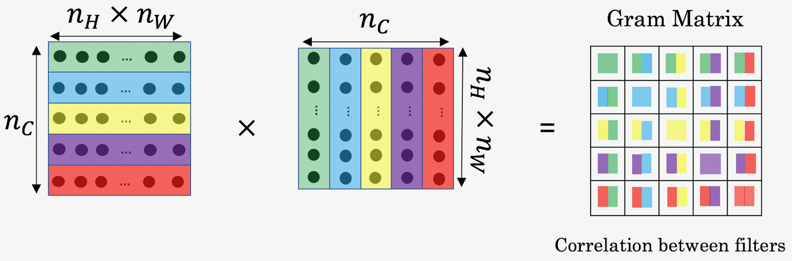

# Sxpecial applications:Face recognition & Neural style transfer

## 1. 什么是人脸识别？(What is face recognition?)

* 人脸验证(**face verification**)问题:如果有一张输入图片以及某人的**ID**或者是名字，系统要做的是验证输入图片是否是这个人，也被称作1对1问题，只需要弄明白这个人是否和他声称的身份相符
* 人脸识别(**face recognition**)问题:(1对多问题(1:K))输入一张人脸图片，验证输出是否为K个模板中的某一个，即一对多问题

一般人脸识别比人脸验证更难。因为假设人脸验证系统的错误率是1%，那么在人脸识别中，输出分别与K个模板都进行比较，则相应的错误率就会增加，约K%。模板个数越多，错误率越大一些

## 2. One-Shot学习(One-shot learning)

要让人脸识别能够做到一次学习，要做的是学习Similarity函数

让神经网络学习用d表示的函数:d(img1,img2)=degree of difference between images

以两张图片作为输入，然后输出这两张图片的差异值

* 如果这两张图片的差异值小于某个阈值 $\tau$，就能预测这两张图片是同一个人
* 如果差异值大于 $\tau$，就能预测这是不同的两个人

对于人脸识别问题，只需计算测试图片与数据库中K个目标的相似函数，取其中d(img1,img2)最小的目标为匹配对象。若所有的d(img1,img2)都很大，则表示数据库没有这个人

如果之后有新人加入了团队，只需将他的照片加入数据库，系统依然能照常工作

## 3. Siamese 网络(Siamese network)

函数d的作用是输入两张人脸，然后输出相似度。实现这个功能的一个方式是用Siamese网络

向量是由网络深层的全连接层计算出来的，叫做 $f(x^{(1)})$。可以把 $f(x^{(1)})$ 看作是输入图像 $x^{(1)}$ 的编码，即取输入图像，然后表示成128维的向量

如果要比较两个图片，要做的是把第二张图片喂给有同样参数的同样的神经网络，得到一个不同的128维的向量，第二张图片的编码叫做 $f(x^{(2)})$

然后定义d，将 $x^{(1)}$ 和 $x^{(2)}$ 的距离定义为两幅图片的编码之差的范数:

$$
d(x^{(1)},x^{(2)})=||f(x^{(1)})-f(x^{(2)})||^2
$$

对于两个不同的输入，运行相同的卷积神经网络，然后比较它们，就叫做Siamese网络架构

训练Siamese神经网络:不同图片的CNN网络所有结构和参数都是一样的。所以要做的是训练一个网络，利用梯度下降算法不断调整网络参数，使得属于同一人的图片之间 $d(x^{(1)},x^{(2)})$ 很小，而不同人的图片之间 $d(x^{(1)},x^{(2)})$ 很大

即神经网络的参数定义了一个编码函数 $f(x^{(i)})$，如果给定输入图像 $x^{(i)}$，这个网络会输出 $x^{(i)}$ 的128维的编码。然后要做的就是学习参数

* 使得如果两个图片 $x^{(i)}$ 和 $x^{(j)}$ 是同一个人，那么得到的两个编码的距离就小
* 如果 $x^{(i)}$ 和 $x^{(j)}$ 是不同的人，那么编码距离就大

如果改变这个网络所有层的参数，会得到不同的编码结果，要做的是用反向传播来改变这些所有的参数，以确保满足这些条件

## 4. Triplet 损失(Triplet 损失)

要想通过学习神经网络的参数来得到优质的人脸图片编码，方法之一就是定义三元组损失函数然后应用梯度下降

三元组损失每个样本包含三张图片:靶目标(Anchor)、正例(Positive)、反例(Negative)，简写成A、P、N

网络的参数或者编码应满足:

让 $∣∣f(A)−f(P)∣∣^2$ 很小，即：

$$
∣∣f(A)−f(P)∣∣^2\leq∣∣f(A)−f(N)∣∣^2
$$

$$
∣∣f(A)−f(P)∣∣^2−∣∣f(A)−f(N)∣∣^2\leq0
$$

$∣∣f(A)−f(P)∣∣^2$ 是 $d(A,P)$，$∣∣f(A)−f(N)∣∣^2$ 是 $d(A,N)$

如果所有的图片都是零向量，即 $f(A)=0,f(P)=0,f(N)=0$ 那么上述不等式也满足。但是对进行人脸识别没有任何作用，所以添加一个超参数 $\alpha$，且 $\alpha>0$，对上述不等式做出如下修改:

$$
∣∣f(A)−f(P)∣∣^2−∣∣f(A)−f(N)∣∣^2\leq-\alpha
$$

$$
∣∣f(A)−f(P)∣∣^2−∣∣f(A)−f(N)∣∣^2+\alpha\leq0
$$

间隔参数 $\alpha$ 也被称为边界margin，类似于支持向量机中的margin，拉大了**Anchor**和**Positive**图片对和**Anchor**与**Negative**图片对之间的差距。若 $d(A,P)=0.5，α=0.2$，则 $d(A,N)\geq0.7$

损失函数的定义基于三元图片组，即取这个和0的最大值:

$$
L(A,P,N)=\max(∣∣f(A)−f(P)∣∣^2−∣∣f(A)−f(N)∣∣^2+\alpha,0)
$$

max函数的作用是只要 $∣∣f(A)−f(P)∣∣^2−∣∣f(A)−f(N)∣∣^2+\alpha\leq0$，损失函数就是0

如果 $∣∣f(A)−f(P)∣∣^2−∣∣f(A)−f(N)∣∣^2+\alpha\geq0$，最终会得到 $∣∣f(A)−f(P)∣∣^2−∣∣f(A)−f(N)∣∣^2+\alpha$，即正的损失值。通过最小化这个损失函数达到的效果就是使这部分 $∣∣f(A)−f(P)∣∣^2−∣∣f(A)−f(N)∣∣^2+\alpha$ 成为0，或者小于等于0

整个网络的代价函数是训练集中单个三元组损失的总和

**如何选择三元组来形成训练集**:如果从训练集中随机地选择A、P和N，遵守A和P是同一个人，而A和N是不同的人这一原则。那么约束条件 $d(A,P)+\alpha \leq d(A,N)$ 很容易达到，因为随机选择的图片，A和N比A和P差别很大的概率很大，而且差距远大于 $\alpha$，这样网络并不能从中学到什么

所以为了构建一个数据集，要做的就是尽可能选择难训练的三元组A、P和N:

想要所有的三元组都满足条件 $d(A,P)+\alpha \leq d(A,N)$，A、P和N的选择应使得 $d(A,P)$ 很接近 $d(A,N)$，即 $d(A,P)\approx d(A,N)$，这样学习算法会竭尽全力使右边式子变大 $d(A,N)$，或者使左边式子 $d(A,P)$ 变小，这样左右两边至少有一个 $\alpha$ 的间隔。并且选择这样的三元组还可以增加学习算法的计算效率

总结:

训练三元组损失需要把训练集做成很多三元组，一个三元组，有一个**Anchor**图片和**Positive**图片，这两个(**Anchor**和**Positive**)是同一个人，还有一张另一个人的**Negative**图片。

定义了这些包括A、P和N图片的数据集之后，还需要用梯度下降最小化代价函数J，这样做的效果就是反向传播到网络中的所有参数来学习到一种编码，使得如果两个图片是同一个人，那么它们的d就会很小，如果两个图片不是同一个人，它们的d就会很大

## 5. 面部验证与二分类(Face verification and binary classification)

另一个训练神经网络的方法是选取一对神经网络，选取**Siamese**网络，使其同时计算这些嵌入，比如说128维的嵌入，或者更高维，然后将其输入到逻辑回归单元进行预测，如果是相同的人，那么输出是1，若是不同的人，输出是0。这就把人脸识别问题转换为一个二分类问题，训练这种系统时可以替换**Triplet loss**的方法

最后的逻辑回归单元怎么处理:

比如说**sigmoid**函数应用到某些特征上，输出 $\hat{y}$ 会变成:

$$
\hat{y}=\sigma(\sum_{k=1}^{128}w_i||f(x^{(i)})_k-f(x^{(j)})_k||^2+b)
$$

把这128个元素当作特征，然后把他们放入逻辑回归中，最后的逻辑回归可以增加参数 $w_i$ 和 $b$，就像普通的逻辑回归一样。然后在这128个单元上训练合适的权重，用来预测两张图片是否是一个人

$\hat{y}$ 的另外一种表达式为:

$$
\hat{y}=\sigma(\sum_{k=1}^{128}w_i\frac{||f(x^{(i)})_k-f(x^{(j)})_k||^2}{f(x^{(i)})_k+f(x^{(j)})_k}+b)
$$

这个公式也被叫做 $\chi^2$ 公式，也被称为 $\chi$ 平方相似度

上面神经网络拥有的参数和下面神经网络的相同，两组参数是绑定的，这样的系统效果很好

如果这是一张新图片，当员工走进门时，希望门可以自动为他们打开。下面的是在数据库中的图片，不需要每次都计算这些特征，可以提前计算好，当一个新员工走近时，使用上方的卷积网络来计算这些编码，和预先计算好的编码进行比较，然后输出预测值 $\hat{y}$

总结:把人脸验证当作一个监督学习，创建一个只有成对图片的训练集，不是三个一组，而是成对的图片，目标标签是1表示一对图片是一个人，目标标签是0表示图片中是不同的人。利用不同的成对图片，使用反向传播算法去训练**Siamese**神经网络

# 这后面的是 —— neural style transfer

## 6. 什么是深度卷积网络？(What are deep ConvNets learning?)

假如训练了一个**Alexnet**轻量级网络，不同层之间隐藏单元的计算结果如下:

从第一层的隐藏单元开始，将训练集经过神经网络，然后弄明白哪一张图片最大限度地激活特定的单元。在第一层的隐藏单元，只能看到小部分卷积神经，只有一小块图片块是有意义的，因为这就是特定单元所能看到的全部。然后选一个另一个第一层的隐藏单元，重复刚才的步骤

对其他隐藏单元也进行处理，会发现其他隐藏单元趋向于激活类似于这样的图片。

以此类推，这是9个不同的代表性神经元，每一个不同的图片块都最大化地激活了。可以理解为第一层的隐藏单元通常会找一些简单的特征，比如说边缘或者颜色阴影

在深层部分，一个隐藏单元会看到一张图片更大的部分，在极端的情况下，可以假设每一个像素都会影响到神经网络更深层的输出，靠后的隐藏单元可以看到更大的图片块

> 第一层，第一个被高度激活的单元
> 第二层检测的特征变得更加复杂
> 第三层明显检测到更复杂的模式
> 第四层检测到的模式和特征更加复杂
> ......

### 总结：

* 浅层的隐藏单元通常会找一些简单的特征，比如边缘或者颜色阴影
* 深层的隐藏单元会看到一张图片更大的部分，在极端的情况下，可以假设每一个像素都会影响到神经网络更深层的输出，靠后的隐藏单元可以看到更大的图片块

## 7. 代价函数(Cost function)

为了实现神经风格迁移，需要定义一个关于 $G$ 的代价函数 $J$ 用来评判某个生成图像的好坏，使用梯度下降法去最小化 $J(G)$，以便于生成图像

代价函数定义为两个部分:

* $J_{content}(C,G)$，被称作内容代价，是一个关于内容图片和生成图片的函数，用来度量生成图片 $G$ 的内容与内容图片 $C$ 的内容有多相似
* 然后把结果加上一个风格代价函数 $J_{style}(S,G)$，用来度量图片 $G$ 的风格和图片 $S$ 的风格的相似度

$$
J(G)=\alpha\cdot J_{content}(C,G)+\beta\cdot J_{style}(S,G)
$$

最后用两个超参数 $\alpha$ 和 $\beta$ 来来确定内容代价和风格代价

对于代价函数 $J(G)$，为了生成一个新图像，要做的是随机初始化生成图像 $G$，可能是100×100×3、500×500×3，或任何想要的尺寸

然后使用之前定义的代价函数 $J(G)$，用梯度下降的方法将其最小化，更新:

$$
G\coloneqq G-\frac{\partial J}{\partial G}
$$

即更新图像 $G$ 的像素值，也就是100×100×3，比如RGB通道的图片

比如从内容图片和风格图片开始，当随机初始化 $G$，生成图像就是随机选取像素的白噪声图。接下来运行梯度下降算法，最小化代价函数 $J(G)$，逐步处理像素，慢慢得到生成图片，越来越像用风格图片的风格画出来的内容图片

## 8. 内容代价函数(Content cost function)

$J(G)$ 的第一部分 $J_{content}(C,G)$，它表示内容图片 $C$ 与生成图片 $G$ 之间的相似度

使用的CNN网络是之前训练好的模型，例如Alex-Net。$C$，$S$，$G$ 共用相同模型和参数

CNN的每个隐藏层分别提取原始图片的不同深度特征，由简单到复杂。如果l太小，则 $G$ 与 $C$ 在像素上会非常接近，没有迁移效果；如果l太深，则 $G$ 上某个区域将直接会出现 $C$ 中的物体。所以在实际中，层l在网络中既不会选的太浅也不会选的太深

衡量内容图片和生成图片在内容上的相似度:

令 $a^{[l][C]}$ 和 $a^{[l][G]}$ 代表图片 $C$ 和 $G$ 的l层的激活函数值。如果这两个激活值相似，意味着两个图片的内容相似

定义:

$$
J_{content}(C,G)=\frac{1}{2}||a^{[l][C]}−a^{[l][G]}||^2
$$

为两个激活值不同或者相似的程度

后面如果对 $J(G)$ 做梯度下降来找 $G$ 的值时，整个代价函数会激励这个算法来找到图像 $G$，使得隐含层的激活值和内容图像的相似

## 9. 风格代价函数(Style cost function)

利用CNN网络模型，图片的风格可以定义成第l层隐藏层不同通道间激活函数的乘积(相关性)

选取第l层隐藏层，各通道使用不同颜色标注。因为每个通道提取图片的特征不同，比如第一个通道提取的是图片的垂直纹理特征，第二个通道提取的是图片的橙色背景特征。那么这两个通道的相关性越大，表示原始图片及既包含了垂直纹理也包含了该橙色背景；相关性越小，表示原始图片并没有同时包含这两个特征。即计算不同通道的相关性，反映了原始图片特征间的相互关系，从某种程度上刻画了图片的“风格”

接下来定义图片的风格矩阵(style matrix)为:

$$
G_{kk'}^{[l]}=\sum_{i=1}^{n_H^{[l]}}\sum_{j=1}^{n_W^{[l]}}a_{i,j,k}^{[l]}\cdot a_{i,j,k'}^{[l]}
$$

$a_{i,j,k}^{[l]}$ 为隐藏层l中 $(i,j,k)$ 位置的激活项，i,j,k 分别代表该位置的高度、宽度以及对应的通道数，k,k' 分别表示不同通道。风格矩阵 $G_{kk'}^{[l]}$ 计算第l层隐藏层不同通道对应的所有激活函数输出和，l层风格图像的矩阵 $G^{[l]}$ 是一个 $n_c×n_c$ 的矩阵:

若两个通道之间相似性高，则对应的 $G_{kk'}^{[l]}$ 较大；若两个通道之间相似性低，则对应的 $G_{kk'}^{[l]}$ 较小

风格矩阵 $G_{kk'}^{[l](S)}$ 表征了风格图片S第l层隐藏层的“风格”。生成图片G**G**也有 $G_{kk'}^{[l](G)}$，$G_{kk'}^{[l](S)}$ 与 $G_{kk'}^{[l](G)}$ 越相近，则表示G的风格越接近S。即 $J_{style}^{[l](S,G)}$ 定义为:

$$
J_{style}^{[l](S,G)}=\frac{1}{4\times n_C^2\times (n_H\times n_W)^2}\sum_{i=1}^{n_C}\sum_{j=1}^{n_C}(G_{ij}^{[l](S)}-G_{ij}^{[l](G)})^2
$$

然后使用梯度下降算法，不断迭代修正 $G$ 的像素值，使 $J_{style}^{[l](S,G)}$ 不断减小

为了提取更多的“风格”，可以使用多层隐藏层，然后相加，表达式为:

$$
J_{style}(S,G)=\sum_l \lambda^{[l]}\cdot J_{style}^{[l](S,G)}
$$

$λ^{[l]}$ 表示累加过程中各层 $J_{style}^{[l](S,G)}$ 的权重系数，为超参数

最终的cost function为:

$$
J(G)=\alpha\cdot J_{content}(C,G)+\beta\cdot J_{style}(S,G)
$$

之后用梯度下降法，或者更复杂的优化算法来找到一个合适的图像 $G$，并计算 $J(G)$ 的最小值，这样将能够得到非常好看的结果

## 10. 一维到三维推广(1D and 3D generalizations of models)

将2D卷积推广到1D卷积:

二维数据的卷积是将同一个5×5特征检测器应用于图像中不同的位置，最后得到10×10的输出结果。1维过滤器可以在不同的位置中应用类似的方法

> 当对这个1维信号使用卷积，将一个14维的数据与5维数据进行卷积，并产生一个10维输出
> 如果有16个过滤器，最后会获得一个10×16的数据
> 对于卷积网络的下一层，如果输入一个10×16数据，可以使用一个5维过滤器进行卷积，需要16个通道进行匹配，如果有32个过滤器，另一层的输出结果就是6×32

3D卷积:

当进行CT扫描时，人体躯干的不同切片数据本质上是3维的

> 如果有一个3D对象是14×14×14
> 过滤器也是3D的，如果使用5×5×5过滤器进行卷积，将会得到一个10×10×10的结果输出，如果使用16个过滤器，输出将是10×10×10×16
> 如果下一层卷积使用5×5×5×16维度的过滤器再次卷积，如果有32个过滤器，最终将得到一个6×6×6×32的输出
