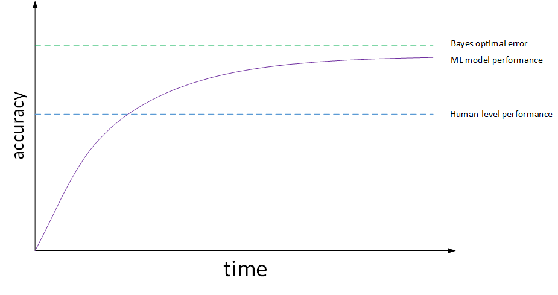
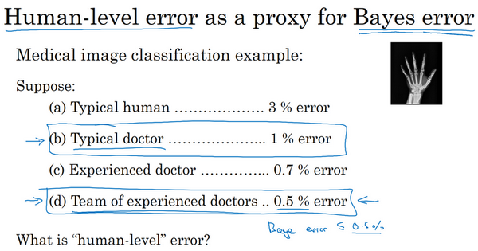
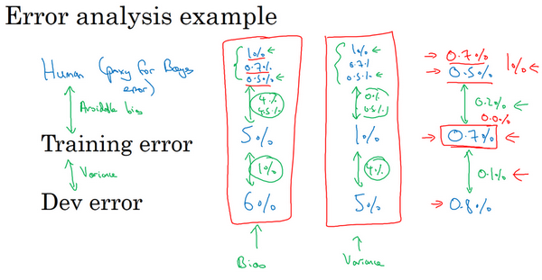

# ML-strategy-introduction

## 1. 为什么是 ML 策略？(Why ML Strategy?)

当最初得到一个深度神经网络模型时，希望从很多方面来对它进行优化，例如：

* **Collect more data**
* **Collect more diverse training set**
* **Train algorithm longer with gradient descent**
* **Try Adam instead of gradient descent**
* **Try bigger network**
* **Try smaller network**
* **Try dropout**
* **Add L2 regularization**
* **Network architecture: Activation functions, #hidden units…**

可选择的方法很多、很复杂、繁琐。盲目选择、尝试不仅耗费时间而且可能收效甚微。因此，使用快速、有效的策略来优化机器学习模型是非常必要的。

## 2. 正交化(Orthogonalization)

每次只调试一个参数，保持其它参数不变，使得到的模型某一性能改变是一种最常用的调参策略，称之为正交化方法(Orthogonalization)

Orthogonalization的核心在于每次调试一个参数只会影响模型的某一个性能

机器学习监督式学习模型大致分成四个独立的“功能”：

* Fit training set well on cost function ，优化训练集可以通过使用更复杂NN，使用Adam等优化算法来实现
* Fit dev set well on cost function，优化验证集可以通过正则化，采用更多训练样本来实现
* Fit test set well on cost function，优化测试集可以通过使用更多的验证集样本来实现
* Performs well in real world，提升实际应用模型可以通过更换验证集，使用新的cost function来实现

每一种“功能”对应不同的调节方法，是正交的

early stopping在模型功能调试中并不推荐使用。因为early stopping在提升验证集性能的同时降低了训练集的性能。即early
stopping同时影响两个“功能”，不具有独立性、正交性

## 3. 单一数字评估指标(Single number evaluation metric)

A和B模型的准确率(Precision)和召回率(Recall)分别如下:

| Classifier | Precision=$\frac{TP}{FP+TP}$ | Recall=$\frac{TP}{FN+TP}$ | F1 score |
| :--------: | :--------------------------: | :-----------------------: | :------: |
|     A     |             95%             |            90%            |  92.4%  |
|     B     |             98%             |            85%            |  91.0%  |

* TP：True Positive，分类器预测结果为正样本，实际也为正样本，即正样本被正确识别的数量。
* FP：False Positive，分类器预测结果为正样本，实际为负样本，即误报的负样本数量。
* TN：True Negative，分类器预测结果为负样本，实际为负样本，即负样本被正确识别的数量。
* FN：False Negative，分类器预测结果为负样本，实际为正样本，即漏报的正样本数量。

使用单值评价指标F1 Score来评价模型的好坏。F1 Score综合了Precision和Recall的大小：

$$
F1=\frac{2\cdot P\cdot R}{P+R}
$$

还可以使用平均值作为单值评价指标：

> 不同国家样本的错误率，计算平均性能，选择平均错误率最小的模型（C模型）

### 说明：

* 下面的是对准确率和召回率的描述！！！！

## 4. 满足和优化指标(Satisficing and optimizing metrics)

当把所有的性能指标都综合在一起，构成单值评价指标比较困难时:可以把某些性能作为优化指标(Optimizing metic)
，寻求最优化值；而某些性能作为满意指标(Satisficing metic)，只要满足阈值就行

Accuracy和Running time这两个性能不太合适综合成单值评价指标。可以将Accuracy作为优化指标(Optimizing metic)，Running
time作为满意指标(Satisficing metic)。给Running time设定一个阈值，在其满足阈值的情况下，选择Accuracy最大的模型。如果设定Running
time必须在100ms以内，模型C不满足阈值条件，剔除；模型B相比较模型A而言，Accuracy更高，性能更好

| Classifier | Accuracy | Running time |
| :--------: | :------: | :----------: |
|     A     |   90%   |     80ms     |
|     B     |   92%   |     90ms     |
|     C     |   95%   |    1500ms    |

如果要考虑N个指标，则选择一个指标为优化指标，其他N-1个指标都是满足指标：

$$
N_{metric}:\begin{cases}1 &Optimizing \ metic\\ N_{metric}-1 &Satisficing \ metic \end{cases}
$$

性能指标(Optimizing metic)需要优化，越优越好；满意指标(Satisficing metic)只要满足设定的阈值

## 5. 训练/开发/测试集划分(Train/dev/test distributions)

训练、开发、测试集选择设置的一些规则和意见：

* 训练、开发、测试集的设置会对产品带来非常大的影响；
* 在选择开发集和测试集时要使二者来自同一分布，且从所有数据中随机选取；
* 所选择的开发集和测试集中的数据，要与未来想要或者能够得到的数据类似，即模型数据和未来数据要具有相似性；
* 设置的测试集只要足够大，使其能够在过拟合的系统中给出高方差的结果就可以，也许10000左右的数目足够；
* 设置开发集只要足够使其能够检测不同算法、不同模型之间的优劣差异就可以，百万大数据中1%的大小就足够；

尽量保证dev sets和test sets来源于同一分布且都反映了实际样本的情况。如果dev sets和test sets不来自同一分布，从dev
sets上选择的“最佳”模型往往不能够在test sets上表现得很好。好比在dev sets上找到最接近一个靶的靶心的箭，但是test
sets提供的靶心却远远偏离dev sets上的靶心，结果肯定无法射中test sets上的靶心位置

## 6. 开发集和测试集的大小（Size of dev and test sets）

* 样本数量不多（小于一万）的时候，通常将Train/dev/test sets的比例设为 60%/20%/20%
* 没有dev sets的情况下，Train/test sets的比例设为 70%/30%
* 样本数量很大(百万级别)的时候，通常将相应的比例设为 98%/1%/1% 或者 99%/1%

dev sets数量的设置，遵循的准则是通过dev sets能够检测不同算法或模型的区别，以便选择出更好的模型

test sets数量的设置，遵循的准则是通过test sets能够反映出模型在实际中的表现

实际应用中，可能只有train/dev sets，而没有test sets。这种情况也是允许的，只要算法模型没有对dev sets过拟合。但条件允许的话，最好有test
sets，实现无偏估计

## 7. 什么时候该改变开发/测试集和指标？(When to change dev/test sets and metrics)

算法模型的评价标准有时候需要根据实际情况进行动态调整，目的是让算法模型在实际应用中有更好的效果

#### example1

假设有两个猫的图片的分类器：

* 评估指标：分类错误率
* 算法A:$3\%$ 错误率
* 算法B:$5\%$ 错误率

初始的评价标准是错误率，A更好一些。实际使用时发现算法A会通过一些色情图片，但是B没有。从用户的角度来说，更倾向选择B模型，虽然B的错误率高一些。这时候需要改变之前只使用错误率作为评价标准，考虑新的情况进行改变。如增加色情图片的权重，增加其代价

假设开始的评估指标如下:

$$
E_{rror}=\frac{1}{m_{dev}}\sum_{i=1}^{m_{dev}}I\{y_{pred}^{(i)}\ne y^{(i)}\}
$$

该评估指标对色情图片和非色情图片一视同仁

修改的方法，在其中加入权重 $w^{(i)}$:

$$
E_{rror}=\frac{1}{\sum w^{(i)}}\sum_{i=1}^{m_{dev}}w^{(i)}I\{y_{pred}^{(i)}\ne y^{(i)}\}
$$

$$
w(i)=\begin{cases}1&x^{(i)}\ is\ non-porn \\10\ or\ 100&x^{(i)}\ is\ porn \end{cases}
$$

通过设置权重，当算法将色情图片分类为猫时，误差项会快速变大

概括来说，机器学习可分为两个过程：

* Define a metric to evaluate classifiers
* How to do well on this metric

第一步是找靶心，第二步是通过训练，射中靶心。但是在训练的过程中可能会根据实际情况改变算法模型的评价标准，进行动态调整,如果评估指标无法正确评估算法的排名，则需要重新定义一个新的评估指标

#### example2

对example1中的两个不同的猫图片的分类器A和B:

实际情况是一直使用网上下载的高质量的图片进行训练；当部署到手机上时，由于图片的清晰度及拍照水平的原因，当实际测试算法时，会发现算法B的表现其实更好

如果在训练开发测试的过程中得到的模型效果比较好，但是在实际应用中所真正关心的问题效果却不好的时候，就需要改变开发、测试集或者评估指标

#### Guideline：

1. 定义正确的评估指标来更好的给分类器的好坏进行排序
2. 优化评估指标

## 8. 为什么是人的表现？(Why human-level performance?)

机器学习模型的表现通常会跟人类水平表现作比较:

当开始往人类水平努力时，进展很快，机器学习模型经过训练会不断接近human-level
performance甚至超过它。超过之后，准确性会上升得比较缓慢，当继续训练算法时，可能模型越来越大，数据越来越多，但是性能无法超过某个理论上限，这就是所谓的贝叶斯最优错误率（Bayes
optimal error）。理论上任何模型都不能超过它，即没有任何办法设计出一个x到y的函数，让它能够超过一定的准确度，bayes optimal
error代表了最佳表现

对于语音识别来说，如果x是音频片段，有些音频很嘈杂，基本不可能知道说的是什么，所以完美的准确率可能不是100%。对于猫图识别来说，也许一些图像非常模糊，不管是人类还是机器，都无法判断该图片中是否有猫。所以完美的准确度可能不是100

贝叶斯最优错误率有时写作**Bayesian**，即省略optimal，就是从x到y映射的理论最优函数，永远不会被超越。无论在一个问题上工作多少年，紫色线永远不会超越贝叶斯错误率，贝叶斯最佳错误率。

机器学习的进展直到超越人类的表现之前一直很快，当超越时，有时进展会变慢。有两个原因：

* 人类水平在很多任务中离贝叶斯最优错误率已经不远
* 只要表现比人类的表现更差，可以使用某些工具来提高性能。一旦超越了人类的表现，这些工具就没那么好用

只要人类的表现比任何其他算法都要好，就可以让人类看看算法处理的例子，知道错误出在哪里，并尝试了解为什么人能做对，算法做错

## 9. 可避免偏差(Avoidable bias)

猫分类器:

人类具有近乎完美的准确度，人类水平的错误是 $1\%$，如果学习算法达到 $8\%$ 的训练错误率和 $10\%$
的开发错误率，算法在训练集上的表现和人类水平的表现有很大差距，说明算法对训练集的拟合并不好。从减少偏差和方差这个角度看，把重点放在减少偏差上。比如训练更大的神经网络，跑久一点梯度下降，试试能不能在训练集上做得更好

同样的训练错误率和开发错误率，假设人类水平错误实际上是
$7.5\%$，系统在训练集上的表现还好，只比人类的表现差一点。在第二个例子中，应专注减少学习算法的方差，可以试试正则化，让开发错误率更接近训练错误率

用人类水平的错误率估计或代替贝叶斯错误率或贝叶斯最优错误率，对于计算机视觉任务而言，这样替代相当合理，因为人类非常擅长计算机视觉任务，人类能做到的水平和贝叶斯错误率相差不远

左边的例子 $8\%$ 的训练错误率真的很高，可以把它降到 $1\%$，减少偏差的手段可能有效。右边的例子中，如果认为贝叶斯错误率是
$7.5\%$，这里使用人类水平错误率来替代贝叶斯错误率，就知道没有太多改善的空间了，不能继续减少训练错误率，训练误差和开发误差之间有更多的改进空间，可以将这个
$2\%$ 的差距缩小一点，使用减少方差的手段，比如正则化，或者收集更多的训练数据

贝叶斯错误率或者对贝叶斯错误率的估计和训练错误率之间的差值称为**可避免偏差**，理论上是不可能超过贝叶斯错误率的，除非过拟合

训练错误率和开发错误率之前的差值，说明算法在方差问题上还有多少改善空间

## 10. 理解人的表现(Understanding human-level performance)

医学图像识别的例子:

在减小误诊率的背景下，人类水平误差在这种情形下应定义为:$0.5\%$ error。但是实际应用中，不同人可能选择的human-level
performance基准是不同的，这会带来一些影响

如果在为了部署系统或者做研究分析的背景下，也许超过一名普通医生即可，即人类水平误差在这种情形下应定义为:$1\%$ error

假如该模型training error为 $0.7\%$，dev error为 $0.8\%$。如果选择Team of experienced doctors，即human-level error为
$0.5\%$，则bias比variance更加突出。如果选择Experienced doctor，即human-level error为
$0.7\%$，则variance更加突出。选择什么样的human-level error，有时候会影响bias和variance值的相对变化。当然这种情况一般只会在模型表现很好，接近bayes
optimal error的时候出现。越接近bayes optimal error，模型越难继续优化，因为这时候的human-level performance可能是比较模糊难以准确定义的

## 11. 超过人的表现(Surpassing human- level performance)

对于自然感知类问题，例如视觉、听觉等，机器学习的表现不及人类。但是在很多其它方面，机器学习模型的表现已经超过人类了，包括：

* Online advertising
* Product recommendations
* Logistics(predicting transit time)
* Loan approvals

机器学习模型超过human-level performance是比较困难的。但是只要提供足够多的样本数据，训练复杂的神经网络，模型预测准确性会大大提高，很有可能接近甚至超过human-level
performance。值得一提的是当算法模型的表现超过human-level performance时，很难再通过人的直觉来解决如何继续提高算法模型性能的问题

## 12. 改善你的模型的表现(Improving your model performance)

提高机器学习模型性能主要要解决两个问题：avoidable bias和variance。training error与human-level error之间的差值反映的是avoidable
bias，dev error与training error之间的差值反映的是variance

基本假设：

* 模型在训练集上有很好的表现；
* 模型推广到开发和测试集时也有很好的表现

减少可避免偏差

* 训练更大的模型
* 训练更长时间、训练更好的优化算法(Momentum、RMSprop、Adam)
* 寻找更好的网络架构(RNN、CNN)、寻找更好的超参数

减少方差

* 收集更多的数据
* 正则化(L2、dropout、数据增强)
* 寻找更好的网络架构(RNN、CNN)、寻找更好的超参数
