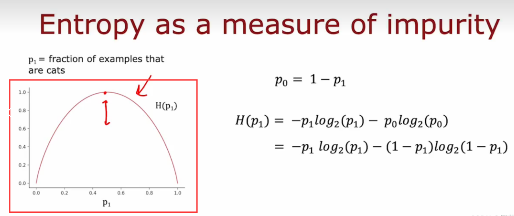
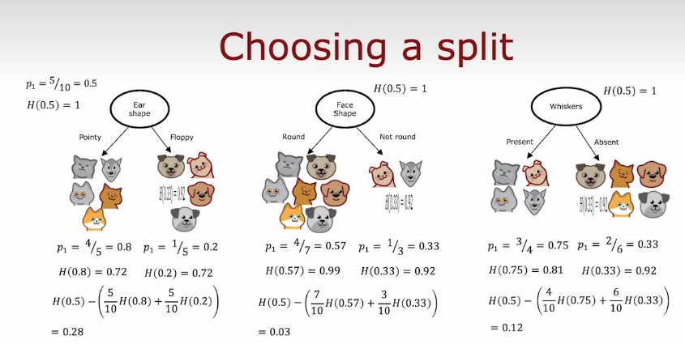
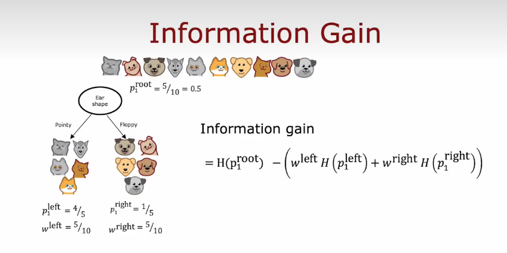
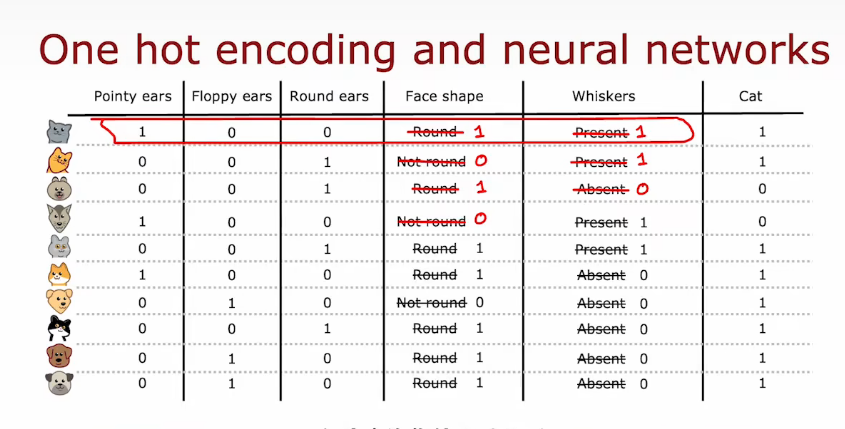
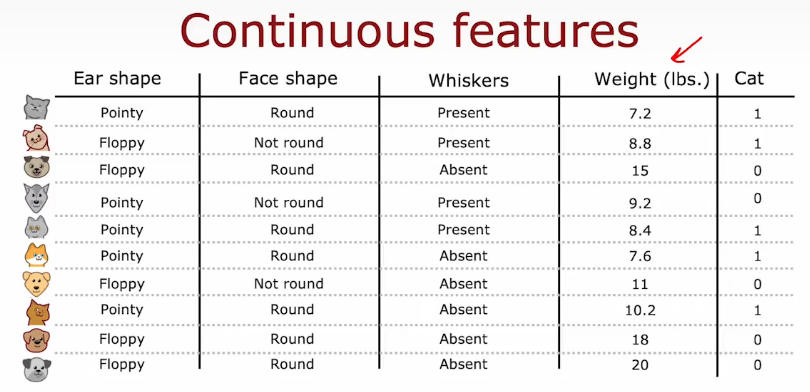
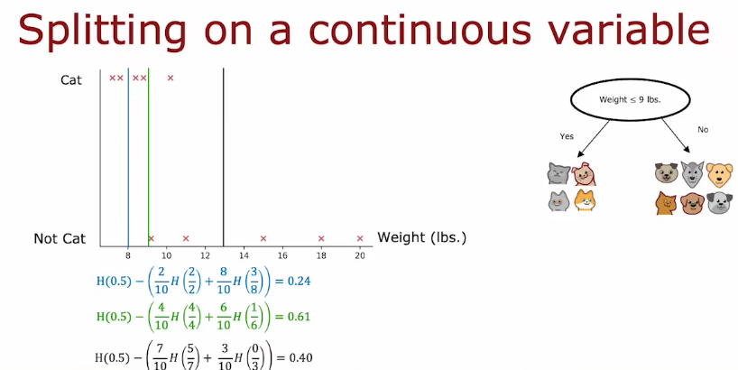
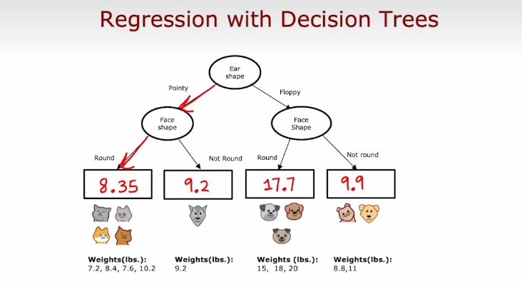
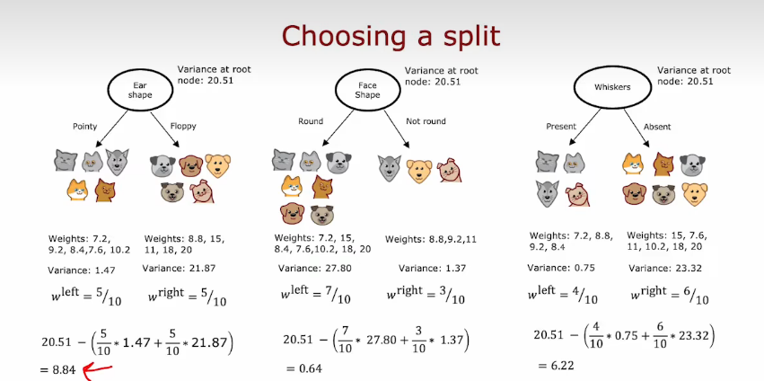

# Decision-Tree-learning

+ root nodes
+ decision nodes
+ leaf nodes

> + **决策1：如何选择在每个节点上分割什么特征？**
>
>   + 最大限度地提高纯度(或最小限度地减少不纯)
> + **决策2：什么时候停止拆分？**
>
>   + 当一个节点是一个单一类时
>   + 当拆分一个节点会导致树超过最大的深度(跳数)
>   + 当纯度分数的改进低于一个阈值（获得的信息增益很小小于阈值）
>   + 当一个节点中的例子数量低于一个阈值

## Entropy as a measure of impurity(衡量纯度、熵entropy、Gini指数)

### 熵

熵（Entropy）通常用于衡量样本集合的不确定性和纯度，也可以**理解为样本集合中随机选取一个样本，其所包含的信息量，混乱程度。**
以二分类问题为例，假设样本集合$D$中包含正例样本数为$\left| D_{+} \right|$，反例样本数为$\left| D_{-} \right|$，则样本集合$D$的熵可以表示为 **(类似逻辑回归 二分类问题用Binary Cross Entropy二元交叉熵损失函数)**

$$
\operatorname{Ent}(D) = -p_+\log_2 p_+ - p_-\log_2 p_-
$$

其中，$p_+$和$p_−$分别表示样本集合中正例和反例的比例，即：

$$
p_+ = \frac {|D_+|} {|D|},\quad p_- = \frac {|D_-|} {|D|}
$$

可以发现，当正例和反例比例相等时，即$p_+=p_−=0.5$时，此时的熵取最大值1，表明此时**样本集合最不确定，样本集合越不纯，熵值越大**；而当样本集合中只包含一类样本(即纯样本集合)时，**熵值为0，表明此时样本集合已经完全确定，很纯。**

在决策树算法中，熵常常被用来选择最优划分点，即**在样本的某个特征上根据熵的变化选取最优的划分点，使得划分后的样本子集中的熵最小。**

### Gini指数

+ Gini指数是一种用于衡量数据集纯度的指标，通常用于决策树算法中。在分类问题中，假设有$K$个类别，数据集$D$中第$k$类样本所占的比例为$p_k$，则Gini指数的计算公式如下：

$$
Gini(D) = \sum_{k=1}^{K}p_k(1-p_k)
$$

Gini指数衡量的是从数据集$D$中随机选取两个样本，其类别不一致的概率，因此Gini指数越小，数据集的纯度越高，分类效果越好。与熵类似，Gini指数也是在0到1之间取值，取值越小表示数据集的纯度越高。

在决策树算法中，选择划分特征时，通常会计算每个特征的Gini指数或信息增益，以选取最佳的划分特征。

## Choosing a split: Information Grain(信息增益)

+ 信息增益衡量的是由于分裂而导致的树中熵的减少
+ 我们决定何时不再进一步分裂的停止标准之一是熵的减少是否太小。如果熵的减少太小或低于阈值，就不再分裂

> 
>
> + $p_1$表示样本集合中正例也即猫的比例，$w^{left}$指的是占样本的权重，$p_1^{left}$代表左枝正例的比例
>
> 
>
> + 在决策树算法中，我们希望通过**选择最优特征来划分数据集**，从而使划分后的数据集更加纯净，即熵减少。而这个**熵减少的量就被称为信息增益**
>   + 信息增益是一种用于**衡量一个特征对分类任务的贡献程度的指标**，通常用于决策树算法中。在决策树算法中，我们需要在每个节点上选择一个特征，使得选定特征后能够最大程度地**提高数据的纯度(即分类的准确性)**。信息增益的计算方法是：首先计算数据集的熵，然后计算选定特征后的条件熵，两者相减即为该特征的信息增益。**信息增益越大，代表该特征对分类任务的贡献越大。**

## Using one-hot encoding of categorical features(独热编码One-hot)

> + 之所以叫one-hot，因为这些特征总有一个取1
>   而这个方式不仅仅适用于决策树，也可以对分类特征进行编码，以便作为输入送入神经网络
>
> 

## Continues valued features

> + 新增体重特征，是连续值
>
> 
>
> + 将特征划分，考虑不同的值，计算分隔后的信息增益，选择一个最好的，能获得最好信息增益的那个！
>   + 一般的做法：**对所有的样本排序**，根据体重大小排序，**取中点值，作为这个阈值的候选值**
>
> 

## 回归树:regression tree

> + 泛化到回归问题，预测一个数字，而不是分类问题
>   + 用一个决策树来回归
>
> 
>
> + 重新选择划分的标准，重新生成
>   在划分时，不去计算信息增益，不去衡量纯度，不如减少数据的方差，类似信息增益，我们测量的是方差的减小，选择方差减少最大的那个特征分类标准
>
> 
