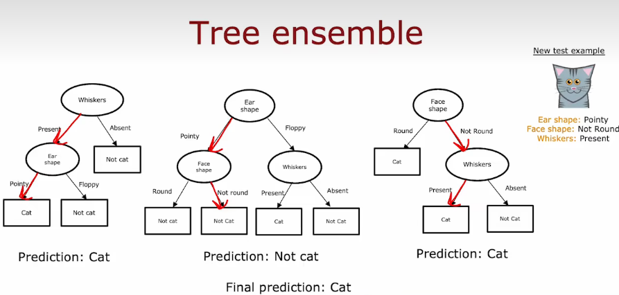
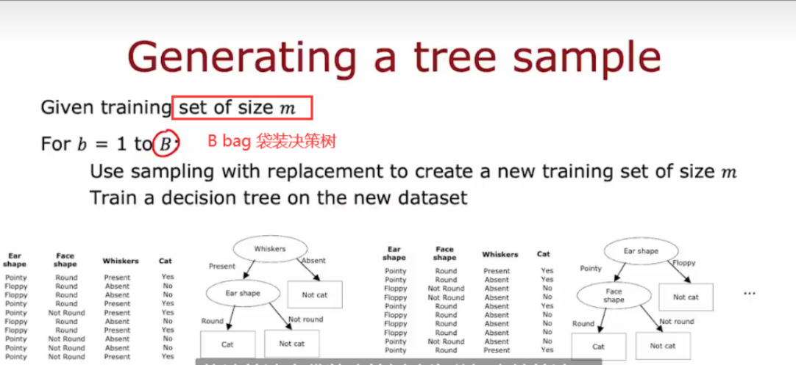
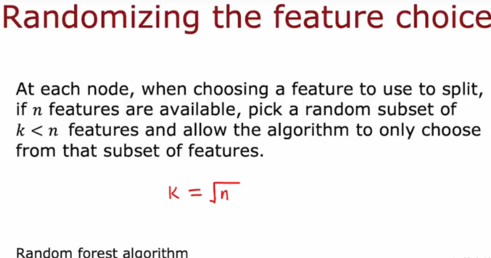

# 树集合:Tree-ensemble

+ 单个决策树受到数据变化的影响很大，导致不同的划分，形成可能不同的树，让算法的健壮性变低；
  使用树集合，让每一颗树投票。
  

## 有放回抽样sampling with replacement(构造多个随机的训练集)

+ 构建树集合的方式如下：构建多个随机的训练集，都与我们最初的训练集略有不同

## 随机森林算法(Random forest algorithm)

> 
>
> + 对于装袋法来说，每次都用所有特征，如果有一些强特征，导致每棵树的分裂方式都类似，这样不同树之间的预测变量就高度相关，这样即使求平均，能减小方差也有限
> + 在这个基础上，随机选k个特征值进行决策树的构建
>
> 
>
> + 在每个节点上，当选择用于分割的特征时，如果有$n$个特征，则从特征中随机挑选一个子集，子集大小为$k(k<n)$，选择$k$个特征作为允许的特征；然后从这$k$个特征中选收获最大信息增益的特征作为分割特征
> + 随机森林是一种集成学习算法，它由多个决策树组成，每个决策树之间相互独立。随机森林的构造方法如下：
>
>   1. 随机选取$n$个样本作为训练集，对于每个样本，随机选取$k$个特征进行决策树的构建。通常情况下，$n$取样总数的70%到80%，$k$取特征总数的平方根。
>   2. 对于每个节点，随机选取k个特征进行划分，并在选取的特征中找到最优划分特征。这里的最优划分是通过计算信息增益或Gini系数等指标得出的。
>   3. 重复步骤1和步骤2，构建多棵决策树。
>   4. 预测时，将新数据输入到每个决策树中，得到每棵树的预测结果，然后根据投票法或平均值等方法，得到随机森林的最终预测结果。
> + 随机森林算法具有良好的泛化性能和抗噪性能，通常被用于分类和回归任务。
