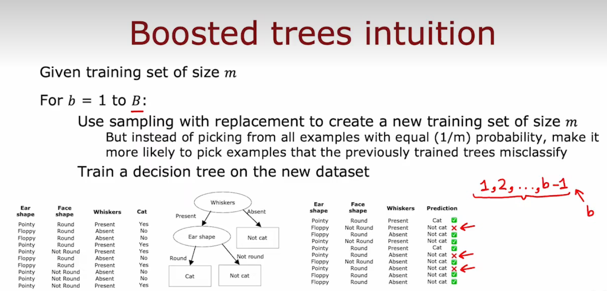
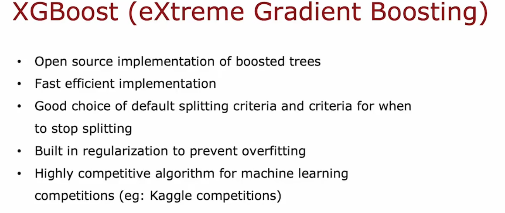
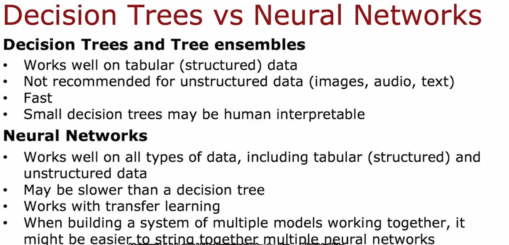

# XGBoost

* 理解boost的思想

  * 我们关注的是我们还没做好的地方，在构建下一个决策树时，把更多的注意力放在做得不好的例子上，不是以相等的(1/m)概率从所有的例子中选取，而是**更有可能选取以前训练的树所错误分类的例子**。
  * 就是我们做错的题目多看多练，之前分类错的样本多放一点
  * boosting 刻意练习 deliberate practice

    
* XGBoost(extreme gradient boosting)极端梯度提升

  
* Using XGBoost

> ```python
> # Classification
> from xgboost import XGBClassifier
> model = XGBClassifier()
> model.fit(X_train,Y_train)
> Y_pred = model.predict(X_test)
>
> # Regression
> from xgboost import XGBRegerssion
> model = XGBRegressor()
> model.fit(X_train,Y_train)
> Y_pred = model.predict(X_test)
> ```
>
>> XGBoost的训练过程是一个逐步迭代的过程。它通过不断训练多棵决策树，并使用梯度下降来对每棵树的权重进行优化，以最小化损失函数。
>> 具体来说，XGBoost在构建每棵树时，会先构建一个根节点，然后逐步将数据集分配到子节点中。每次分配数据集时，XGBoost都会根据一个指定的评价函数来选择最佳的特征进行分裂，并计算每个子节点的权重。通过这种方式，XGBoost可以在不断迭代中构建多棵树，并综合它们的预测结果来提高模型的准确率。
>>

# When to use decision trees

* 何时使用决策树、神经网络?
* 决策树
  * 决策树可以很好处理表格数据(结构化数据)
  * 训练很快
  * 小型的决策树具有可解释性
* 神经网络
  * 适用于所有类型的数据，表格和非结构化数据(包括图像、影像)
  * 可能比较慢
  * 可以迁移学习、预训练


