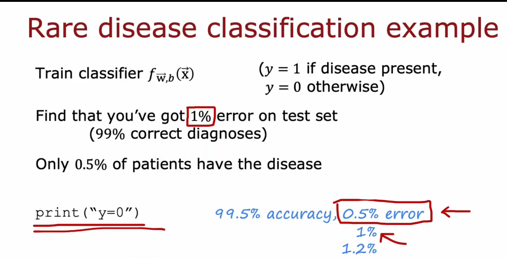
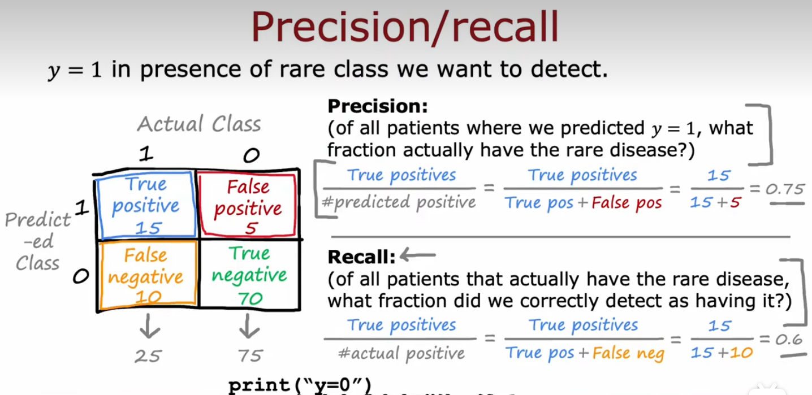
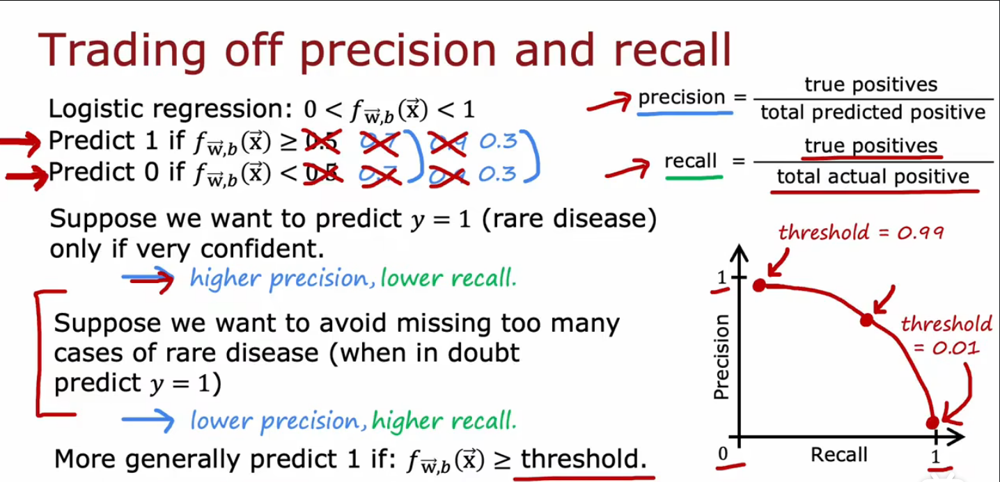
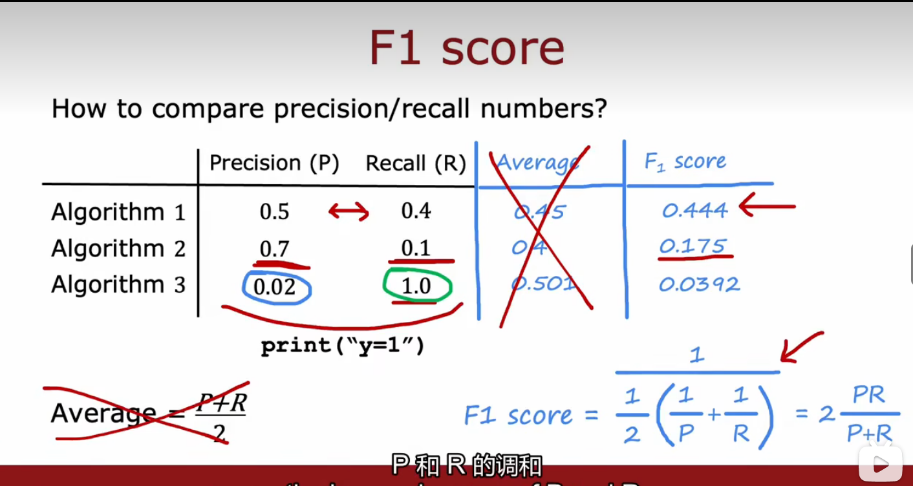

## 倾斜数据集的误差指标 Error metrics for skewed datasets

+ 数据倾斜
  + 某个类别的样本数只有另一个类别的1/10，这个数据集就是倾斜的。这种情况也常常出现在诸如诈骗检测、医学诊断、罕见事件预测等领域中，因为这些问题中正例（positive）的数量通常比负例（negative）少得多。
+ 例子： 罕见症预测
  + 使用不同的误差量度，而不仅仅是分类误差!
    

## 精确率和召回率 Precision/recall、混淆矩阵

+ 精确率：就是预测为阳性的病人中 真正为阳性的人的比例（找的对 ）
+ 召回率：在所有患有罕见病的人中，我们真正正确检测的比例（阳了的人，有多少被正确的检测出来了，找的全）
+ 对于这个罕见病识别的例子：
  + 在医学诊断领域中，通常更关注召回率，因为漏诊罕见病患者可能会导致严重后果
    

## 精确率（找的对）和召回率（找的全）的权衡、F1score

**我们将患病的样本标记为正类，未患病的样本标记为负类。在这种情况下**

+ 手动选择一个阈值来权衡精度和召回率

> + 如果治病的代价很大，患病后果不难么严重，只在我们十分有把握的情况下去预测y=1，设置更高的阈值（如0.7），这样precision会增加（因为是十分有把握，找的对的概率大了）；recall会减少（假阴性FN的结果增多，即实际患病的样本被错误地判断为未患病）
>
>> 如果我们将阈值设置得比较高，模型会更倾向于将未患病的样本判断为负类，这样会导致假阴性的结果增多，即实际患病的样本被错误地判断为未患病，从而导致召回率recall的下降。但是，由于正类被错误地预测为负类的情况减少了，所以精度precision会随之提高。
>>
>
> + 另一方面，如果我们不想漏掉罕见病病例，治疗风险不大，但不治疗的结果很坏，可以减低阈值，结果跟上面相反
> + 总结：
>   我们需要根据具体情况来选择更注重精确率还是召回率。对于不同的应用场景，我们可能会有不同的需求。如果我们更关心查准率，那么就需要选择更高的精确率阈值，这样可以减少假阳性的情况，提高预测结果的准确性；如果我们更关心查全率，那么就需要选择更低的精确率阈值，这样可以减少假阴性的情况，提高预测结果的召回率
>   

+ F1 score 自动权衡精度和召回率

  + F1 score（F1值）是一种综合评价分类器性能的指标，结合了分类器的准确率和召回率。它是准确率和召回率的**调和平均数（取平均值的方法，更强调较小的值）**，通常用于**评估二元分类器的性能**。
  + F1 score 的计算公式为：
    $$
    F1score=2\frac{Precision\times Recall}{Precision+recall}
    $$

  > 在计算 F1 score时，精确率和召回率对结果的贡献是一样的。因此，F1 score强调了精确率和召回率同等重要。
  > 当精确率和召回率差异较大时，F1 score的值会受到最小值的影响。例如，当精确率很低但召回率很高时，F1 score的值会受到精确率的影响而降低，因为 F1 score 考虑了两者的平均值。
  > 
  >

## 一些专业概念

+ 高精确率：判定为true的置信度高
+ 高召回率：判定为false的置信度高

> 置信度是指一个统计推断中，对于一个参数或者假设所得到的推断结果的可信程度或者确定性程度。置信度通常使用置信区间来度量，表示参数或假设在一定置信水平下的可能取值范围。
> 置信度高表示推断所得的结果越可信，即在一定置信水平下，得到的置信区间越小，说明参数或假设的可能取值范围越小，结果越精确可靠。

+ 阈值的选择会直接影响模型的预测结果，其中较高的阈值会使模型更倾向于将样本归类为负类，而较低的阈值则会使模型更倾向于将样本归类为正类。

### 混淆矩阵

> |                    | Actual Positive | Actual Negative |
> | ------------------ | :-------------: | :-------------: |
> | Predicted Positive |       TP       |       FP       |
> | Predicted Negative |       FN       |       TN       |
>
> 左上角是真正例（True Positive，TP），表示模型正确预测出了正例；
> 右上角是假正例（False Positive，FP），表示模型将负例错误预测为正例；
> 左下角是假反例（False Negative，FN），表示模型将正例错误预测为负例；
> 右下角是真反例（True Negative，TN），表示模型正确预测出了负例。
>
> + 精确率（Precision）
>
>   + 是指被分类器正确识别为正例的样本数占所有分类器判定为正例的样本数的比例，即：$$Precision=\frac{TP}{TP+FP}$$
>
>   + 其中，TP表示真正例（True Positive），即实际为正例且被分类器正确识别的样本数；FP表示假正例（False Positive），即实际为负例但被分类器错误识别为正例的样本数。
> + 召回率（Recall）
>
>   + 是指被分类器正确识别为正例的样本数占所有实际为正例的样本数的比例，即：$$Recall=\frac{TP}{TP+FN}$$
>   + 其中，TP表示真正例（True Positive），即实际为正例且被分类器正确识别的样本数；FN表示假负例（False Negative），即实际为正例但被分类器错误识别为负例的样本数。
