## debugging a learning algorithm

+ Get more training examples
+ Try smaller sets of features
+ Try getting additional features
+ Try adding polynomial features ($x_{1}^2$，$x_{2}^2$,$x_{1}x_{2},etc$)
+ Try decrease or increase $\lambda$

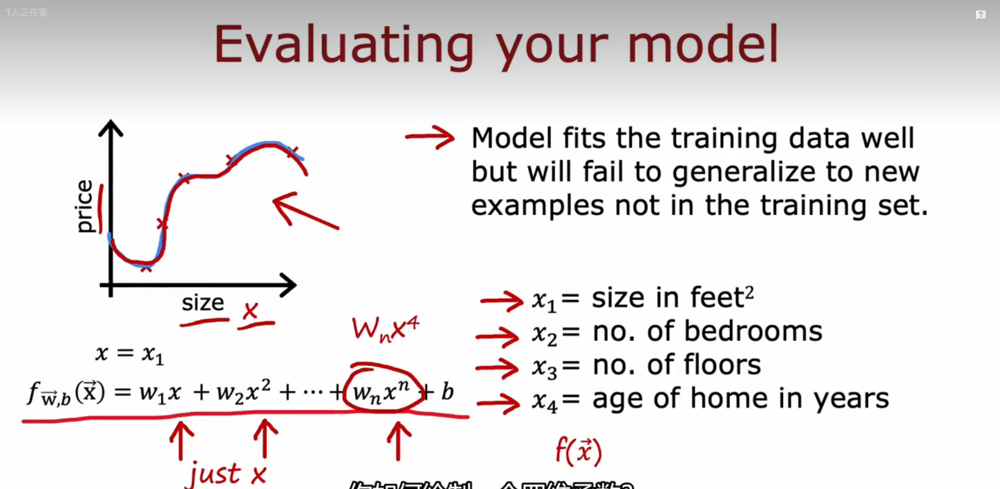

## Evaluating your model

+ training set / test set

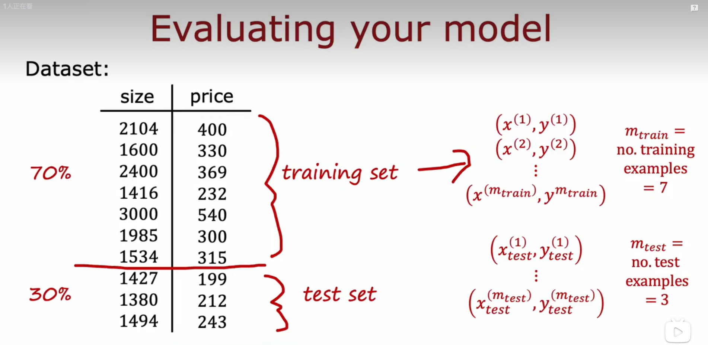

> $$
> (x^{(1)},y^{(1)})\newline(x^{(2)},y^{(2)})\newline \vdots\newline(x^{(m_{train})},y^{(m_{train})})
> $$
>
> $$
> (x_{test}^{(1)},y_{test}^{(1)})\newline \vdots\newline(x_{test}^{(m_{train})},y_{test}^{(m_{train})})
> $$

+ Train/test procedure for linear regression(with squared error cost)

> + Fit parameters by minimizing cost function $J(\vec{w},b)$
>
> $$
> J(\vec{w},b)=\underset{\vec{w},b}{min}[\frac{1}{2m_{train}} \sum_{i=1}^{m_{train}}(f_{\vec{w},b}(x^{(i)})-y^{(i)})^2+\frac{\lambda}{2m_{train}}\sum_{j=1}^{n}w_{j}^2]
> $$
>
> + Compute test error
>
> $$
> J_{test}(\vec{w},b)=\frac{1}{2m_{test}} \sum_{i=1}^{m_{test}}(f_{\vec{w},b}(x_{test}^{(i)})-y_{test}^{(i)})^2
> $$
>
> + Compute training error
>
> $$
> J_{train}(\vec{w},b)=\frac{1}{2m_{train}} \sum_{i=1}^{m_{train}}(f_{\vec{w},b}(x_{train}^{(i)})-y_{train}^{(i)})^2
> $$

+ Train/test procedure for classfication problem

> + Fit parameters by minimizing cost function $J(\vec{w},b)$
>
> $$
> J(\vec{w},b)=-\frac{1}{m}\sum_{i=1}^{m}[y^{(i)}\log f_{\vec{w},b}(\vec{x}^{(i)})+(1-y^{(i)})\log (1-f_{\vec{w},b}(\vec{x}^{(i)})]+\frac{\lambda}{2m}\sum_{j=1}^{n}w_{j}^2
> $$
>
> + Compute test error
>
> $$
> J_{test}(\vec{w},b)=-\frac{1}{m_{test}}\sum_{i=1}^{m_{test}}[y_{test}^{(i)}\log f_{\vec{w},b}(\vec{x}_{test}^{(i)})+(1-y_{test}^{(i)})\log (1-f_{\vec{w},b}(\vec{x}_{test}^{(i)})]
> $$
>
> + Compute training error
>
> $$
> J_{train}(\vec{w},b)=-\frac{1}{m_{train}}\sum_{i=1}^{m_{train}}[y_{train}^{(i)}\log f_{\vec{w},b}(\vec{x}_{train}^{(i)})+(1-y_{train}^{(i)})\log (1-f_{\vec{w},b}(\vec{x}_{train}^{(i)})]
> $$

### Training/Cross-validation/test set

+ 我们的模型选择过于依赖于测试集，可能和实际结果有较大的偏差，这时需要使用交叉验证集（Cross-validation set）来帮助选择模型。
  + 交叉验证集通常是独立于训练集和测试集的
  + 通常用6/2/2的划分，即60%的数据作为训练集，20%的数据作为交叉验证集，20%的数据作为测试集

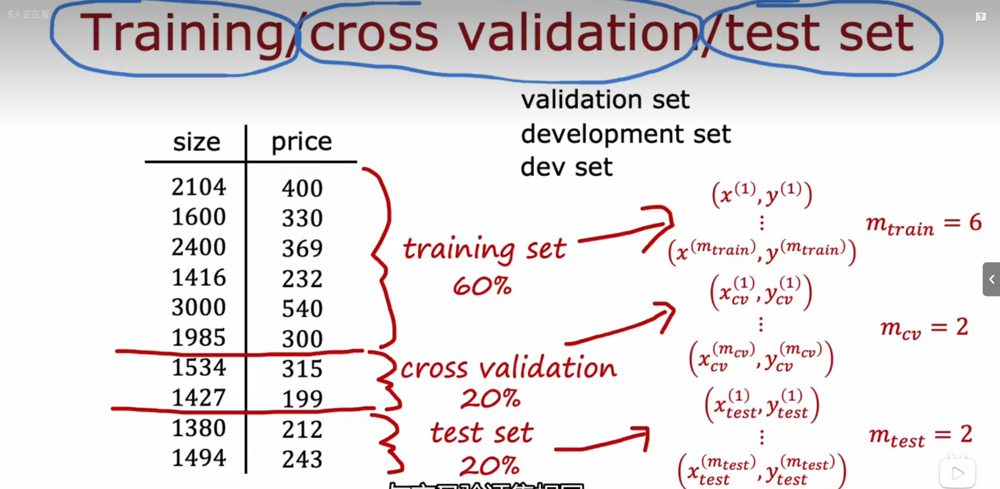

> 训练误差(Training error):
>
> $$
> J_{train}(\vec{w},b)=\frac{1}{2m_{train}} \sum_{i=1}^{m_{train}}(f_{\vec{w},b}(x^{(i)})-y^{(i)})^2
> $$
>
> 交叉验证误差(Cross Validation error):
>
> $$
> J_{cv}(\vec{w},b)=\frac{1}{2m_{cv}} \sum_{i=1}^{m_{cv}}(f_{\vec{w},b}(x^{(i)})-y^{(i)})^2
> $$
>
> 测试误差(Test error):
>
> $$
> J_{test}(\vec{w},b)=\frac{1}{2m_{test}} \sum_{i=1}^{m_{test}}(f_{\vec{w},b}(x^{(i)})-y^{(i)})^2
> $$

+ 使用不同的次方进行拟合，通过$J_{cv}$进行判断，最后将测试集带入
+ **不仅对于回归算法，几乎所有的算法都可以通过这种方式进行判断选择与测试**
+ 虽然现实中有人用测试集来计算交叉验证误差，并用同样的测试集来计算测试误差，但这并不是一个好的做法，除非有大量的训练数据... Anyway，不推荐这种做法，还是将数据集分成训练数据、交叉验证数据和测试数据吧。

## 偏差(Bias)和方差(Variance)

+ 如果一个机器学习算法表现不理想，多半出现两种情况：
  + 要么是偏差比较大，要么是方差比较大。
  + 换句话说，出现的情况要么是欠拟合，要么是过拟合问题

例如下图，依次对应的是欠拟合、正常、过拟合：

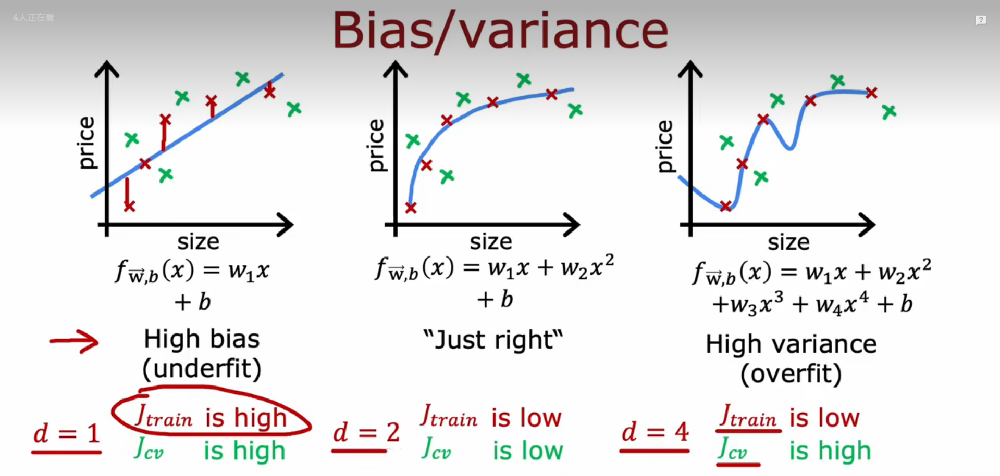

为了分析模型性能，通常会将训练集和交叉验证集的代价函数误差与多项式的次数绘制在同一张图表上来帮助分析：


+ 上图可看出：

  + 对于训练集，当$d$较小时，模型拟合程度更低，误差较大；随着$d$的增长，拟合程度提高，误差减小。
  + 对于交叉验证集，当$d$较小时，模型拟合程度低，误差较大；但是随着$d$的增长，误差呈现先减小后增大的趋势，转折点是模型开始过拟合训练数据集的时候。
+ 根据上面的图表，还可以总结判断高方差、高偏差的方法：

  + 训练集误差和交叉验证集误差近似时：
    + 高偏差/欠拟合
  + 交叉验证集误差远大于训练集误差时：
    + 高方差/过拟合

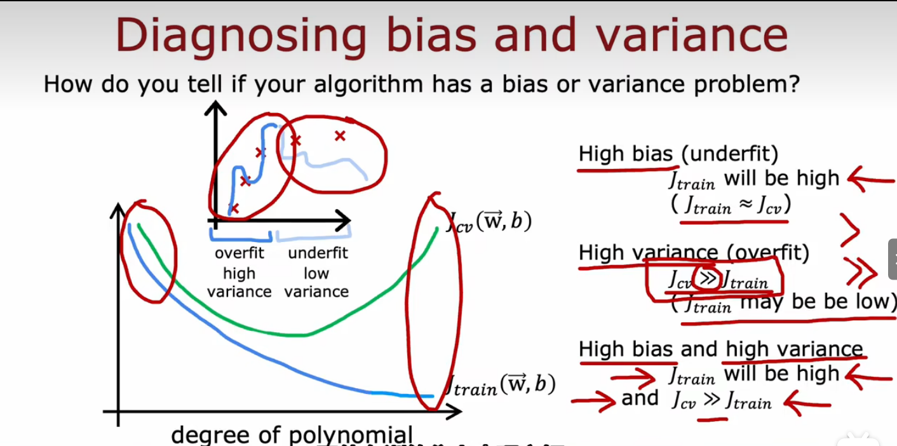

## 正则化和偏差/方差

在训练模型时，一般会用正则化方法来防止过拟合。但是可能会正则化程度太高或太小，即在选择λ的值时也需要思考与此前选择多项式模型次数类似的问题。如下图是不同的 _λ_ 对应不同拟合程度：

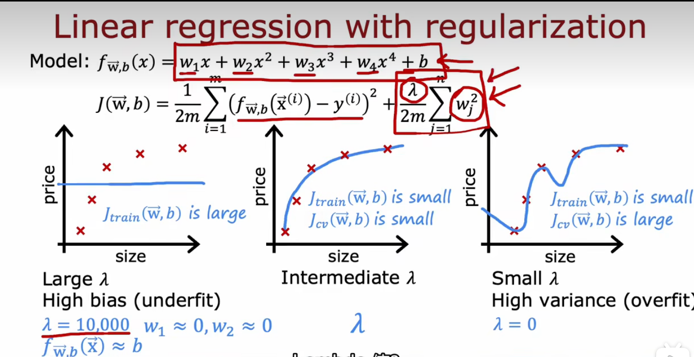

通常会尝试一系列的 _λ_ 值，以测试最佳选择：

1. 使用训练集训练出12个不同程度正则化的模型
2. 用12个模型分别对交叉验证集计算的出**交叉验证误差**
3. 选择得出**交叉验证误差最小**的模型
4. 运用步骤3中选出模型对测试集计算得出推广误差

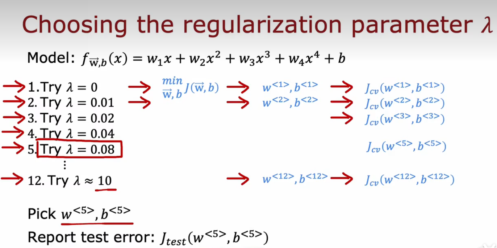

也可以同时将训练集和交叉验证集模型的代价函数误差与λ的值绘制在一张图表上（如下图），可以看出训练集误差和 _λ_ 的关系如下：

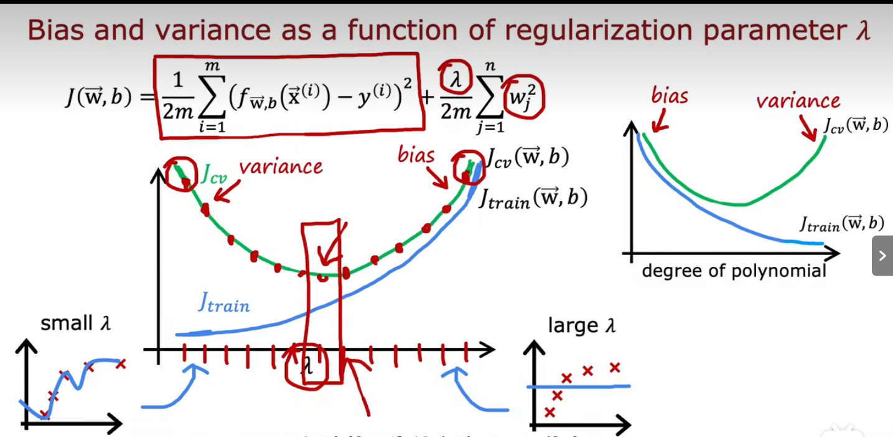

+ 总结：
  + 当 _λ_ 较小时，训练集误差较小（过拟合）而交叉验证集误差较大
  + 随 _λ_ 的增加，训练集误差不断增加（欠拟合），而交叉验证集误差则是先减小后增加

## 学习曲线

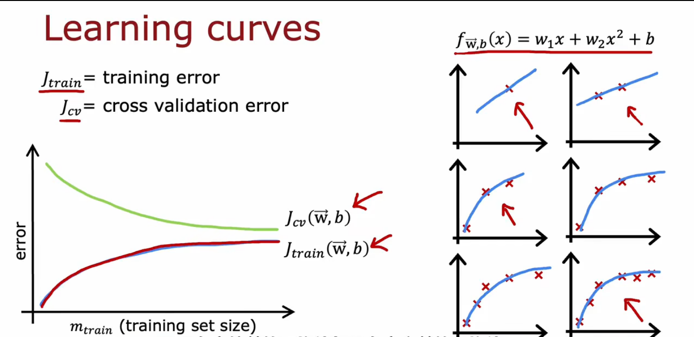
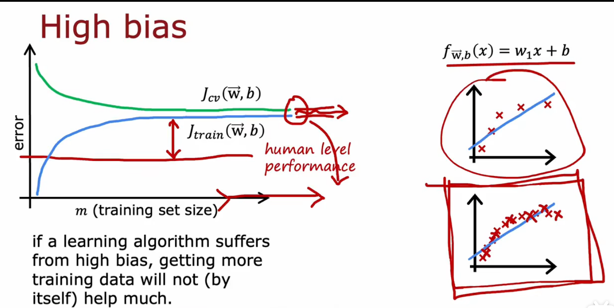
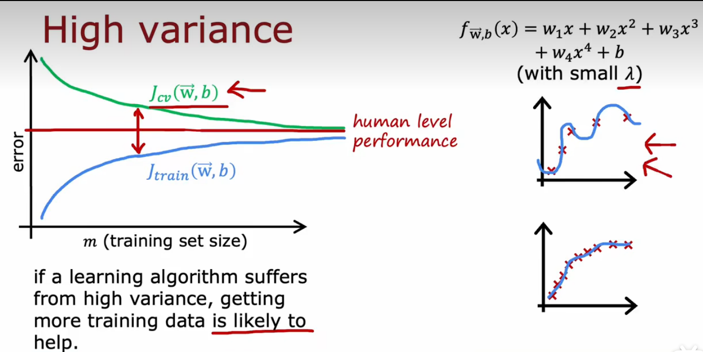

## 总结：决定下一步做什么

1. 增加训练样本数 _m_ ——解决高方差
2. 减少特征的数量 _n_ ——解决高方差
3. 获得更多的特征 _n_ ——解决高偏差
4. 增加多项式特征 _n_ ——解决高偏差
5. 减少正则化程度 _λ_ ——解决高偏差
6. 增加正则化程度 _λ_ ——解决高方差

## the code(正则化)

```python
import numpy as np
layer_1 = Dense(units=3,activation='relu')
layer_2 = Dense(units=3,activation='relu')
layer_3 = Dense(units=1,activation='sigmoid')
model = Sequential([layer_1, layer_2, layer_3])

# Regularized
layer_1 = Dense(units=3,activation='relu',kernel_regularizer=L2(0.01))
layer_2 = Dense(units=3,activation='relu',kernel_regularizer=L2(0.01))
layer_3 = Dense(units=1,activation='sigmoid',kernel_regularizer=L2(0.01))
model = Sequential([layer_1, layer_2, layer_3])
```

## add more data

+ Data augmentation by introducing
  + Distortion introduced should be representation of type of noise/distortions in the test set
+ 数据增强
  + 对于图像数据 扭曲
  + 对于音频数据 添加噪声
+ 数据合成
  + 一般用于计算机视觉干扰
  + 有一些时候，关注数据是帮助算法提高性能的有效方法！
