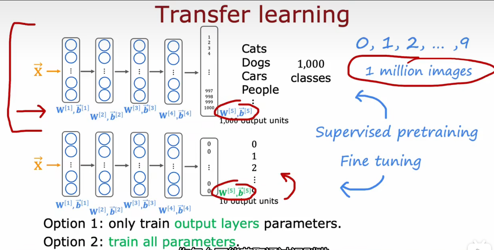
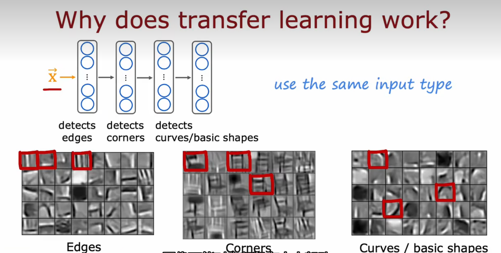
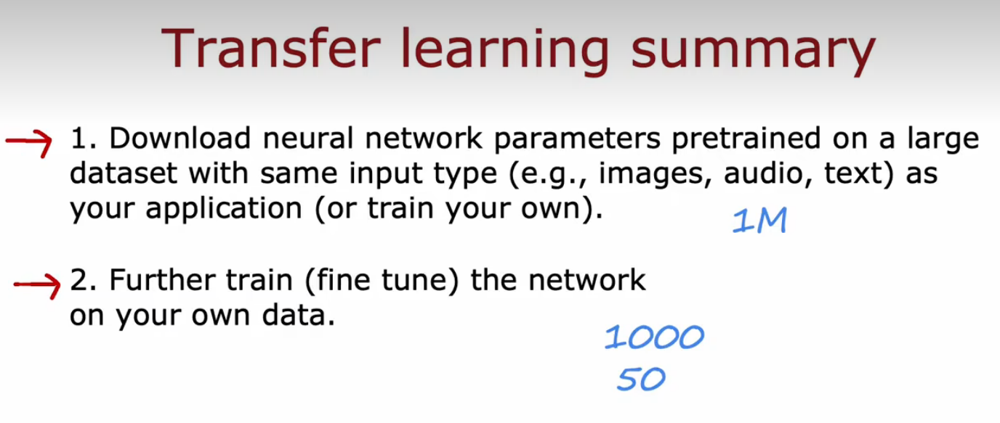
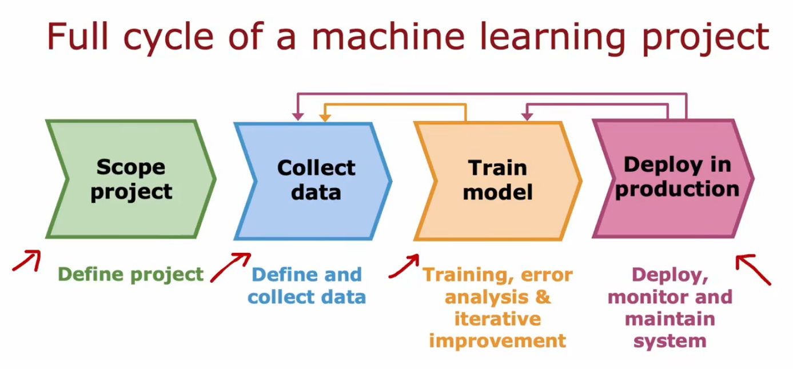
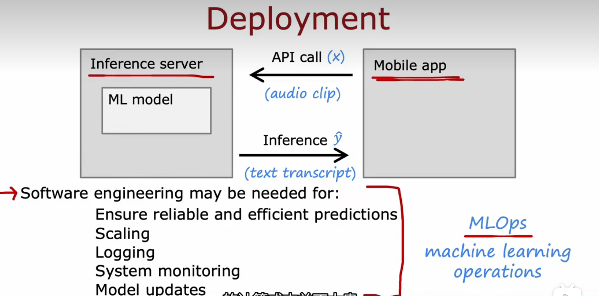

## 迁移学习 transfer learning（监督预训练）

+ 作用：让你用来自不同任务的数据来解决当前的任务
  
+ 微调方法一（训练集很小）
  + 前4个参数仍然保留，只需要更新输出层的参数，利用gd或者adam优化算法来最小化代价函数
+ 微调方法二（训练集很大）
  + 重新训练所有参数，但前四层的参数还是用上面的值作为初始值！
+ **example:**
> 1. 因为两个网络的本质都是图像分类，所以在隐藏层的大部分工作都是相似甚至一样的
> 2. 所以直接把第一个网络的隐藏层拿过来用，对输出层重新训练就能实现新的功能
> 3. 相当于螺丝刀的刀柄都是一样的，但把十字刀刀头换成一字刀作用就不一样了，下面的图可以帮你理解迁移学习的原理：
> 

+ 预训练
  + 监督预训练supervised pretraining:首先在大型数据集上进行训练，然后在较小的数据集上进行进行参数微调(fine tuning)利用已经初始化的或者从预训练模型获取的参数，运行gd，进一步进行微调权重，以适应手写数字识别任务

## 机器学习项目的完整周期
+ Full cycle of a machine learning project

+ MLOps 机器学习操作
  + MLOps将机器学习项目管理的方法与软件工程方法相结合，以建立高效、可重复、可维护的机器学习系统。这种方法强调持续学习、持续优化和自动化，以确保机器学习模型能够在不断变化的环境中保持最佳状态。
