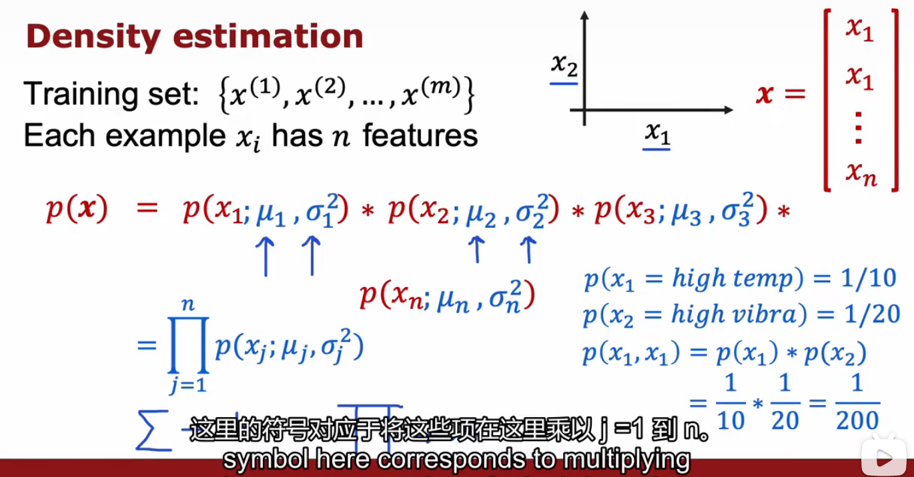

# anomaly-Detection

## Find unusual events

#### 密度估计density estimation

* 异常检测中的密度估计是指根据已知数据集的分布情况，推测新的样本数据在该数据集中的概率分布，并利用这种概率分布来判断样本是否异常。
* 一种常见的密度估计方法是基于高斯混合模型(Gaussian Mixture Model, GMM)的方法。假设已知数据集由多个高斯分布组成，每个高斯分布对应数据集中的一个簇，那么可以通过最大化似然函数来估计这些高斯分布的参数，从而得到整个数据集的概率分布模型。具体来说，对于一个新的样本数据，可以计算它在该模型下的概率密度值，如果该值较小，则认为该样本是异常值。

## 高斯正态分布Gaussian (Normal) Distribution

* 利用$3\sigma$原则判断是否为异常值
  在实际应用中，$3\sigma$原则通常用于质量控制和异常值检测。例如，对于某一批次的生产产品，如果其尺寸的标准差小于三倍，那么可以认为这批产品的尺寸基本上是符合要求的。而如果有个别产品尺寸偏离平均值超过三倍标准差，那么这个产品就可以被认为是异常值，需要进行进一步的检测和处理。

* 这里$x$是单个数字，单一特征，对应的异常检测只有一个特征，但实际会有很多特征

## Algorithm:异常检测算法

* 公式符号
  * 每一个样本$x^{(i)}$都有$n$个特征，$\vec{x}$是一个特征向量，在这里比如发动机的热量和振动，我们要做的是密度估计，估计$p(\vec{x})$。
  * 这个特征向量$\vec{x}$的所有特征的概率$p(\vec{x})=p(x_1)p(x_2)\dots p(x_n)$，为了给$x_1$的概率建模，比如这个例子中的第一个特征热量，我们有两个参数$mu_1$、$\sigma_1$（我们需要估计所有样本的所有特征$x_1$的均值和方差）
  * $x^{(i)}$ 表示的是第几个样本 ，$x^{(i)}_j$表示的是第$i$个样本的第$j$个特征

## Developing and evaluating an anomaly detection system

* 测试集的调整，当数据过于少的时候，可以不使用test集，只是用交叉集进行讨论

* 可能存在的影响因素，如何对异常检测进行讨论？

## 异常检测与监督学习的对比

## Choosing what features to use
* 让参数的统计数据符合高斯分布

* 考察某些特殊位置的样本的参数特性

* 尝试将旧特征组合成为新特征

