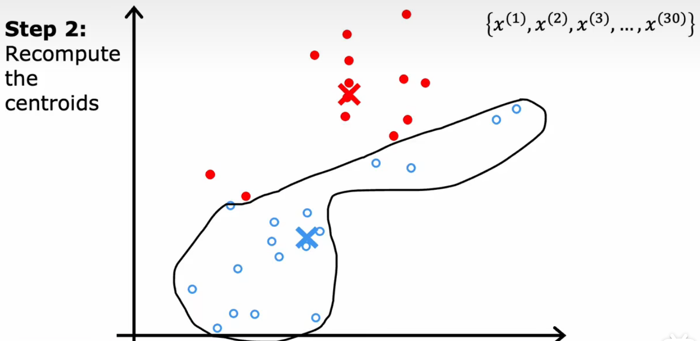
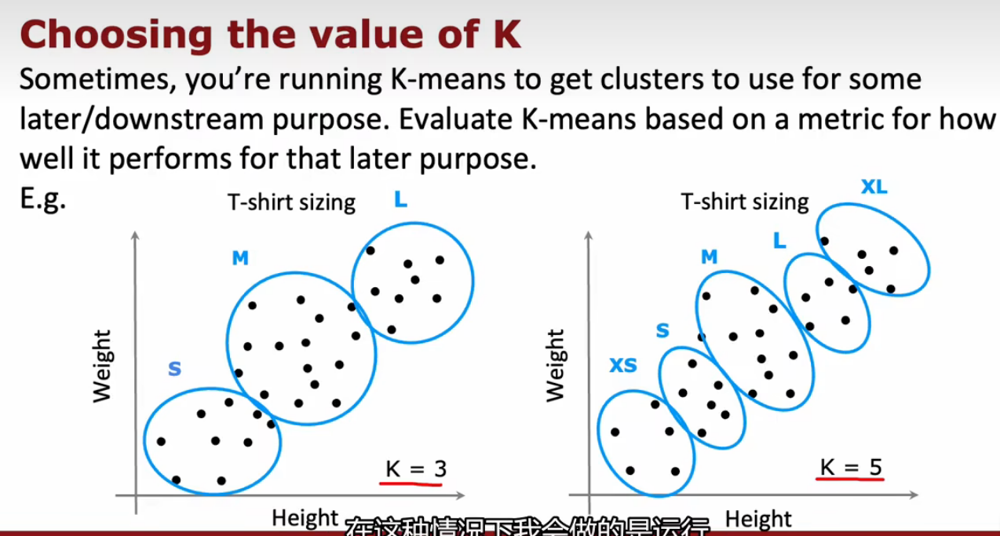

# clustering 聚类

## K-means intuition 算法原理

* 理解K-means如何工作，关键两个步骤：
  * 第一步，把每个点分配给簇质量心，分配给离它最近的簇质心
  * 第二步，把每个簇质心分配给它所有点的平均位置;直到簇质心没有变化

## K-means algorithm

* 计算距离采用$L2$范数也称为欧几里得范数，是指向量各元素的平方和再开方，它可以用来衡量向量的大小。在二维空间中，向量(_x_,_y_)的$L2$范数为 $\sqrt{x^2 + y^2}$ 。在机器学习中，$L2$范数常用于正则化技术中，可以限制模型的复杂度，防止过拟合。
* 在使用这个算法的时候，会出现没有聚类的极端情况，即分到的点数为0。这种情况下，要么直接删除这个聚类，要么重新进行随机选取。
* 例子：

## Optimization objective

#### 一些符号

* $C^{(i)}$，表示当前训练样本$X_i$所在的簇的索引$1\sim k$，是每个样本的分类标识
* $\mu_k$ 是簇质心的位置
* 当$k=C^{(i)}$时，$\mu_{C^{(i)}}$是样本$X_i$被分配到的簇，这个簇的簇质心的位置
* $m$是所有样本个数

#### K-means的代价函数(失真函数distortion function)

## Initializing K-means:初始化K-means

K-means聚类算法第一步是为簇质心$\mu_j$，$\mu_k$选择随机位置作为初始值。如果初始值选的不好，会陷入局部最小值，多次运行K-means，计算他们的$J$，选最小的那个

## What is the right value of K?:如何选择聚类的簇的数量K

* 肘部法则 elbow method （一般不用）
  * 运行具有各种K值的k-means，绘制代价函数-K的函数，找到肘关节位置，但比较主观
* 根据K-means在稍后或下游任务中的表现来评估具体的K值合不合适

