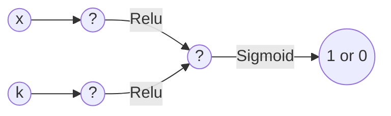
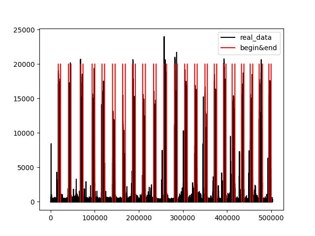
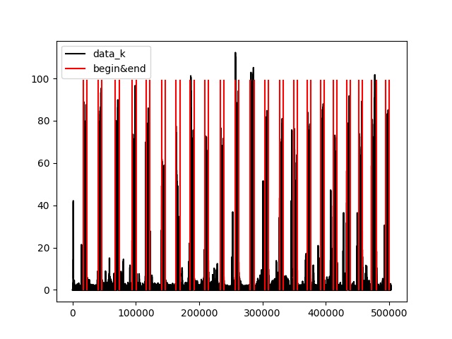

# VAD算法设计与报告

## 算法设计



* 我们将所有的点分为 1（在说话）和 0（没有说话），下面将以1和0来代替对应片段
* 我们设计算法的思路是从阈值法出发，我们认为只进行振幅上的判断对于声音判断的误差比较大，因此我们想通过同时讨论斜率的方式进一步将数据进行筛选，增大算法精度
* 我们的斜率是采用将数据进行左右100间距的斜率以及两边斜率做平均获取的预估斜率

```python
k_1 = (data[i + self.length] - data[i]) / self.length
k_2 = (-data[i - self.length] + data[i]) / self.length
k_3 = (data[i + self.length] - data[i - self.length]) / (self.length * 2)
k_ = (k_1 + k_2 + k_3) / 3
```

* 上图是我们所设计的神经网络，我们分别对阈值和斜率进行判断，将输出值进行判断，利用Relu激活函数，使用一层线性层加上Sigmoid激活函数将两种点进行分类

> 说明：为了方便进行观察和调整参数，且第二层的权重可以有效的代替第一层的权重，所以将第一层的权重设为1且不参与训练
> 下面的图片是人工划分的区间以及斜率，振幅对应图像，可以看到斜率其实也是对区间的一种判断方式

<div align="center">


</div>

* 在音频中，1所对应的片段要少于0所对应的片段，在初次尝试的过程中，我们发现召回率往往偏小，因此我们自定义了loss-function，增大结果为1但是预测为0的权重

```python
# 具体可见code/python/model_for_practice
class WeightedBCELoss(torch.nn.Module):
    def __init__(self, weight_for_one=10.0):
        super(WeightedBCELoss, self).__init__()
        self.weight_for_one = weight_for_one

    def forward(self, inputs, targets):
        assert inputs.size() == targets.size(), "Input and target tensors should have the same shape"
        loss = F.binary_cross_entropy_with_logits(inputs, targets, reduction='none')
        wrong_ones = (inputs < 0.5) & (targets == 1)
        loss[wrong_ones] *= self.weight_for_one
        return loss.mean()
```

事实上在算法获得的所有的1点是分散的，这是因为声音的振幅和斜率是震荡的，我们所取到的不过是其中的部分点，但是我们能保证的是几乎所有的1点都是在区间内的，我们想通过观察1点的聚合来讲对应的区间取到。我们认为在0.3秒以内是不能判断声音的，所以我们通过如下代码进行获取对应区间

> 同时，我们为了防止一些点突然出现偏差，我们认为一次发声时间至少是800次，也就是0.1秒

```python
# 具体可见code/python/test
current_list = []
all_lists = []

prev_true_index = -1
for index, value in enumerate(y_hat_):
    if value:
        if prev_true_index == -1:
            current_list.append(index)
        else:
            diff = index - prev_true_index
            # 判断是否属于同一次发声
            if diff <= 2400:
                current_list.append(index)
            else:
                # 判断是否为一次发音 —— 一次发音的时间不低于0.1秒
                if current_list[-1] - current_list[0] > 800:
                    all_lists.append(current_list)
                current_list = [index]
        prev_true_index = index

if current_list and current_list[-1] - current_list[0] > 800:
    all_lists.append(current_list)
```

## 测试报告

* 由于数据集过小，我们使用了1折交叉验证
* 以下我们对原数据的测试结果，可以看到训练结果本身对train的效果不错，其中data_10的precision肯是因为精度问题所导致

|        说明        | Audio   | f1_score           | accuracy           | recall             | precision          |
|:----------------:|---------|--------------------|--------------------|--------------------|--------------------|
| 训练data_5和data_10 | data_1  | 0.907922589049202  | 0.9537816296402408 | 0.8816923136256701 | 0.9357614159176122 |
| 训练data_1和data_10 | data_5  | 0.9107750552108528 | 0.9623138919323327 | 0.8602749523204068 | 0.9675738481476516 |
| 训练data_1和data_5  | data_10 | 0.8642185343305621 | 0.898203940557221  | 0.7607695387006381 | 1.0002291007486022 |

* 以下是三次训练出的参数以及最终求平均之后获得的结果

| Audio   | layer_1_weight | layer_1_bias | layer_2_weight | player_2_bias | layer_3_weight   | player_3_bias |
|---------|----------------|--------------|----------------|---------------|------------------|---------------|
| data_1  | 1              | -18.4771     | 1              | -19997.2605   | [3.6371, 2.6949] | -0.0010       |
| data_5  | 1              | -24.7667     | 1              | -19997.2630   | [0.5668, 2.9847] | -0.0012       |
| data_10 | 1              | -27.8052     | 1              | -19999.1062   | [0.5638, 0.8002] | 0.0004        |
| avg     | 1              | -23.6830     | 1              | -19997.8765   | [1.5892, 2.1599] | -0.0006       |

* 以下是使用avg获取的测试结果，足以说明训练的效果不错

| Audio   | f1_score           | accuracy           | recall             | precision          |
|---------|--------------------|--------------------|--------------------|--------------------|
| data_1  | 0.9067660121361988 | 0.9543009148173349 | 0.8598557599598905 | 0.959090087842314  |
| data_5  | 0.9173689722236075 | 0.9646665035617157 | 0.8771137952956135 | 0.9614969162688596 |
| data_10 | 0.87333180933162   | 0.9033163719959709 | 0.7826547672310264 | 0.9877735642705151 |

## 说明

**在python进行训练的过程中，采取的是先将wav的数据通过c进行提取，所以在这其中没有对wav文件直接提取数据的过程，是先将数据获取之后存入csv文件中，再进行的训练和测试
**
